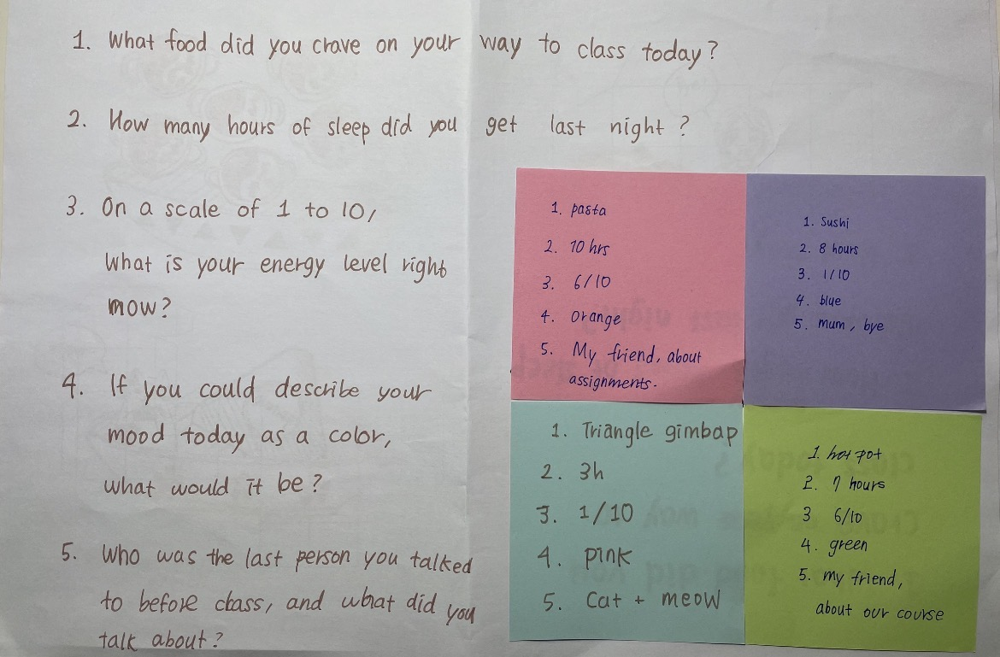

## Experiment 1: Data Drawings

[← Back to Home](../index.md)

## Documentation 
### In-Class Activity: Group Data Portrait

For this studio exercise, I worked in a group of four to create a set of questions and a collaborative data drawing that represented our group as a data portrait. We decide our questions to capture small, everyday experiences. 

- Qualitative: What food did you crave on your way to class today?
- Embodied: How many hours of sleep did you get last night?
- Subjective: On a scale of 1 to 10, what is your energy level right now?
- Playful: If you could describe your mood today as a colour, what would it be?
- Relational: Who was the last person you talked to before class, and what did you talk about?

*Figure 1: Groups Data Question and Answer*

After creating these questions, we designed a visual concept called the Plate / Food Theme Data Portrait. We used food and plates as a metaphor to represent different aspects of each person’s daily life and emotional state.

*Figure 2: Group Data Visualisation*

Each person was represented by a plate. 
- The main food item showed what food they craved on the way to class. 
- The number of patterns on the plate represented hours of sleep.
- The number of food items represented energy level.
- The colour of the plate represented today mood.
- Person eating the food with a speech bubble to show the last person they talked to and the topic of conversation.

This visual system allowed us to represent multiple types of personal data in a playful and expressive way. Instead of using charts or graphs, we created a visual portrait that communicated personality, mood, and daily experiences through a shared visual language.

## Images & Media

*Use the format below to embed images from your assets folder:*

``
`*Your caption here*`

*The text inside the square brackets is alt text (a description for accessibility), not a visible caption. To add a caption, place a line of italic text below the image.*

## AI Usage Statement

*Document any use of AI tools under an AI Usage Statement heading. Explain which tools you used and describe how you used them. Reference any AI-generated content (see [QuickCite](https://auckland.libguides.com/referencing-generative-ai-tools) for guidance).*
