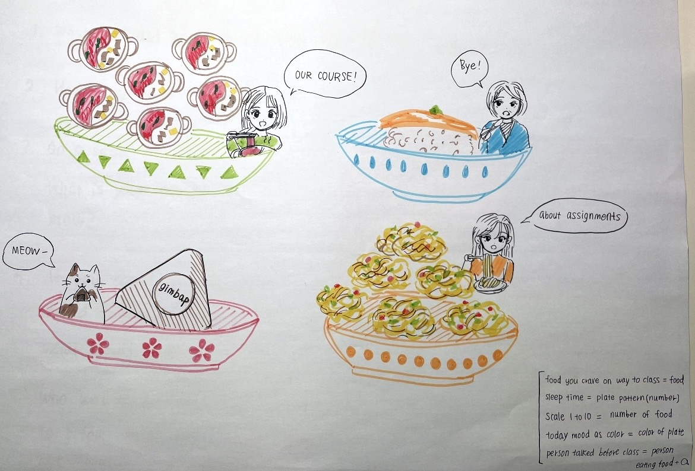
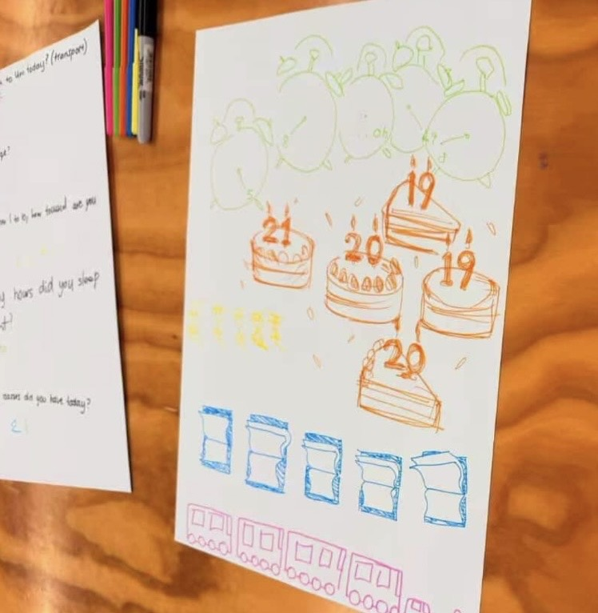
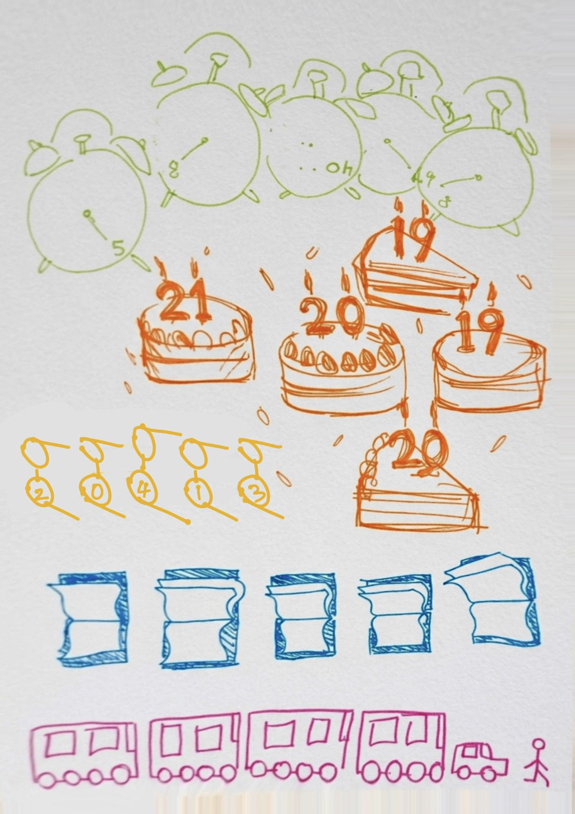
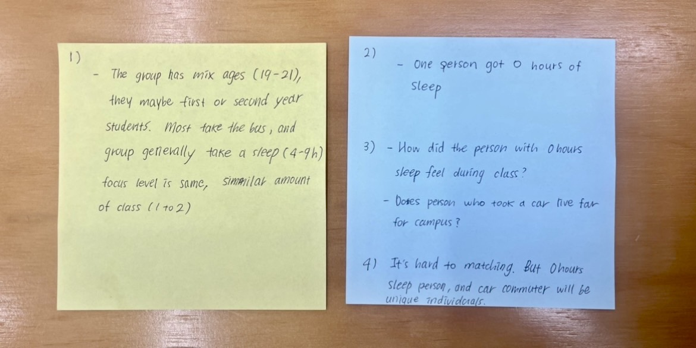
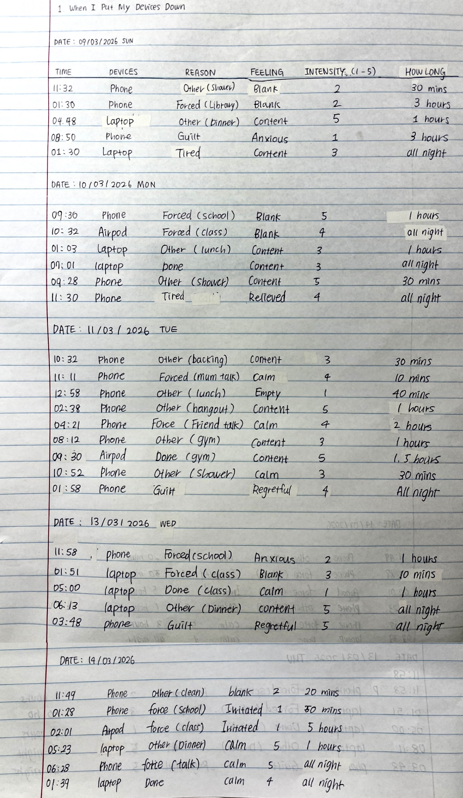
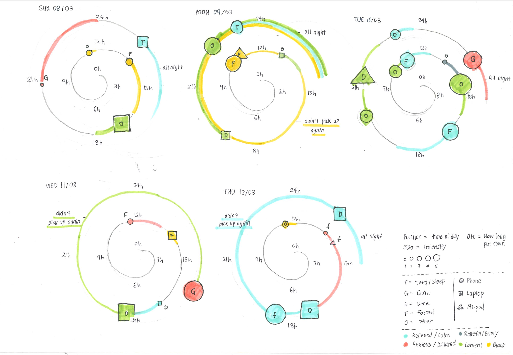

## Experiment 1: Data Drawings

[← Back to Home](../index.md)

### In-Class Activity: Group Data Portrait

For this studio exercise, I worked in a group of four to create a set of questions and a collaborative data drawing that represented our group as a data portrait. We decide our questions to capture small, everyday experiences. 

- Qualitative: What food did you crave on your way to class today?
- Embodied: How many hours of sleep did you get last night?
- Subjective: On a scale of 1 to 10, what is your energy level right now?
- Playful: If you could describe your mood today as a colour, what would it be?
- Relational: Who was the last person you talked to before class, and what did you talk about?

*Figure 1: Groups Data Question and Answer*

After creating these questions, we designed a visual concept called the Plate / Food Theme Data Portrait. We used food and plates as a metaphor to represent different aspects of each person’s daily life and emotional state.

*Figure 2: Our group's data portrait using food and plates to represent each member*

Each person was represented by a plate, allowing us to distinguish individuals without using names or direct identifiers. The placement of each plate on the page helped separate each participant while maintaining a collective composition.

- The main food item showed what food they craved on the way to class. 
- The number of patterns on the plate represented hours of sleep.
- The number of food items represented energy level.
- The colour of the plate represented today mood.
- Person eating the food with a speech bubble to show the last person they talked to and the topic of conversation.

We also included a legend to explain how each visual element corresponds to the data.

This visual system allowed us to represent multiple types of personal data in a playful and expressive way. Instead of using charts or graphs, we created a visual portrait that communicates personality and daily experiences. Through illustration, enabled us to capture aspects of human emotion and individuality that would be difficult to represent in a spreadsheet.

### Other Group Data Portrait

*Figure 3: Other group's data portrait : I can't see it well, so I'm drawing it again.*
After see other group data, I answered these questions :

- What can you learn about the people in this group from their data portrait?
- What surprised you?
- What questions do you have for them?
- Can you tell who is who?

*Figure 4: Answers to the Questions*

### Independent Study: Data Portrait

Topic: When I Put My Devices Down
I recorded data from Sunday to Thursday on paper and visualized it.

*Figure 5: Independent Study: My Data*

*Figure 6: Independent Study: My Data visualisation*

### Reflection

For my independent study, I collected data on March 8-13 by recording when I put down or turned off my electronic devices. I noted on my physical paper the time, the device, the reason, my emotion after stopping, and how long I took it again. I also noted the intensity of each emotion on a scale of 1–5. I could visualise not only the type of feeling but its strength to add depth to the data. I chose this topic because I spend a lot of time using digital devices, but I rarely think about how I feel when I stop using them.

Recording these moments shows unexpected insights about my relationship with my devices. For example, putting my phone down after scrolling through SNS right up until bed give sense of anxiety, whereas closing my laptop after finishing an assignment brings a sense of relief. Even small moments like taking off my AirPods after finishing exercising gave me a sense of contentment. 

To translate this data into a visual representation, I created a spiral “emotion flow” on A4 paper. Each device was represented by a distinct shape (circle for phone, square for laptop, triangle for AirPods), while color indicated my immediate emotion (red for anxiety/ Irritated, grey for regretful/ empty, yellow for blank, blue for relieved/ calm, green for content). The size of each shape indicated the intensity of my feeling, and arc marks indicated the duration of picking up the device again. Arranging the data in a spiral allowed me to represent the sequence of the day while also conveying the flow and rhythm of my emotional experiences.

This exercise made me realize that short moments of disconnect of the devices often had a stronger positive effect than I expected. In contrast, putting down devices after a stressful task sometimes left residual anxiety. These show how intertwined my emotions are with technology. By documenting and visualising these moments, I was able to see my daily life as a series of emotional peaks and troughs mediated by my devices.

Connecting this to data humanism and the Dear Data project, the exercise highlights how personal, imperfect, and subjective data can be meaningful. Instead of relying on digital logs or apps, hand-recording my experiences allowed for empathy, reflection, and intentionality. This portrait of my daily life makes the invisible: my emotional responses to technology visible in a tangible, human-centered way.