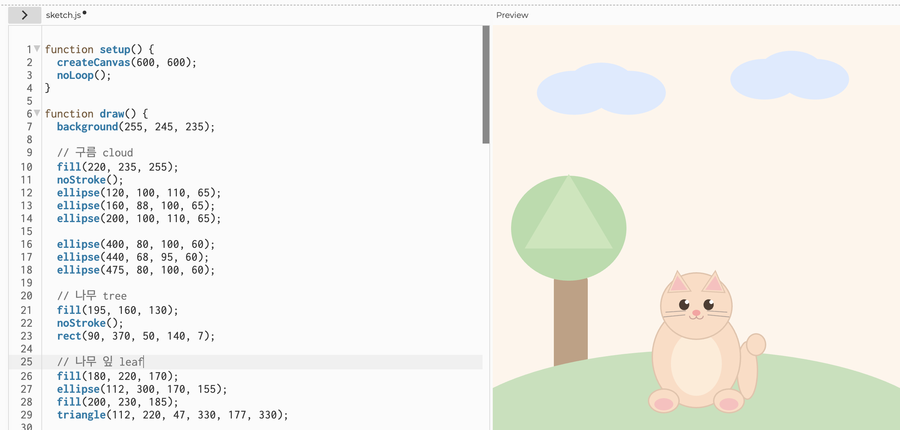

## Experiment 2: Interactive Data Portrait

[← Back to Home](../index.md)

### In-Class Activity

## Activity 1: Drawing with Code 

To get familiar with the p5.js editor, I practice creating a simple triangle, ellipse, and rectangle, experimenting with colour, size, and position.

*Figure 7: practice 1*

Then I create a simple composition using at least three
different shapes.

*Figure 8: practice 2*

*Figure 9: practice 3*

Sometime coordinate system was confusing. Especially, working out which numbers controlled x, y, width, and height in functions like ellipse(200, 100, 110, 65). Expect this, experimenting with colour, size, and position was enjoyable. I also discovered that p5.js renders shapes in the order they are written. Therefore, moving the tree earlier in the code placed it behind the cat. This helped me understand how layering works in digital drawing.

## Activity 2: Make an Interactive Sketch

사진 특히 gif 넣긔...

In Activity 2, I created an interactive sketch using a slider, a button, and a text input. The slider controlled the size of a circle, the button changed the colour, and the text input displayed text on the screen. This made the drawing interactive rather than static.

## Activity 3: Make an Interactive Sketch

*Use the format below to embed images from your assets folder:* 내일 하자... 에이아이 써서 하는ㄱㅓ임

### Independent Study: Interactive Data Portrait

## AI Usage Statement

### Step 1: Translate your data drawing into code

### Step 2: Design your interactive visualisation

### Step 3: Iterate

해야댐... 넣어야댐 

Document Your Process
To capture the full scope of your practice, each entry in the Making Journal must include a mix of visual and textual evidence, such as sketches, screenshots, GIFs, diagrams, process notes, instructions and reflections.

Include reflective writing that addresses the following:

What data and visual aspects from Experiment 1 did you choose to work with, and why?
How did you decide which interactive elements to use?
What can a viewer learn by interacting with your sketch that they couldn't from your hand-drawn portrait?
Did you use vibe coding or other tools in your process? What did you learn from this?
What would you develop further with more time?
Any other reflections?

*Document any use of AI tools under an AI Usage Statement heading. Explain which tools you used and describe how you used them. Reference any AI-generated content (see [QuickCite](https://auckland.libguides.com/referencing-generative-ai-tools) for guidance).*
