# Experiment 2 : Interactive Data Portrait

[← Back to Home](../index.md)

## In-Class Activity

### Activity 1: Drawing with Code 

I used https://p5js.org/reference/ while working on this assignment.

To get familiar with the p5.js editor, I practice creating a simple triangle, ellipse, and rectangle, experimenting with colour, size, and position.

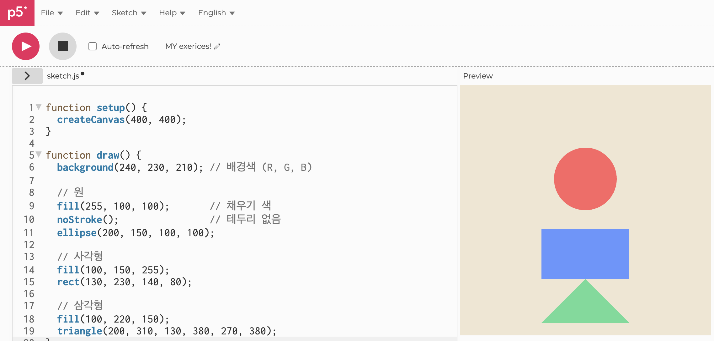
*Figure 7: practice 1*

Then I create a simple composition using at least three
different shapes.

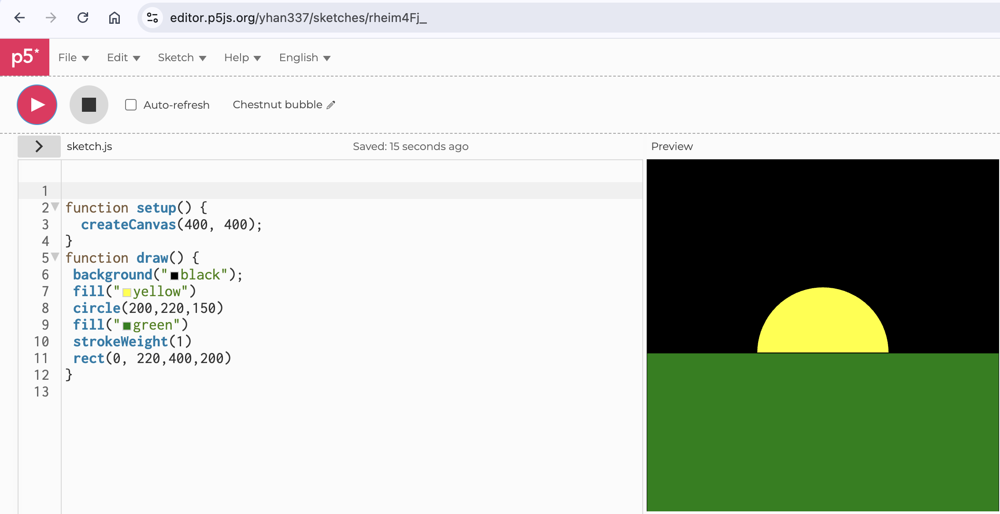
*Figure 8: class practice 2*

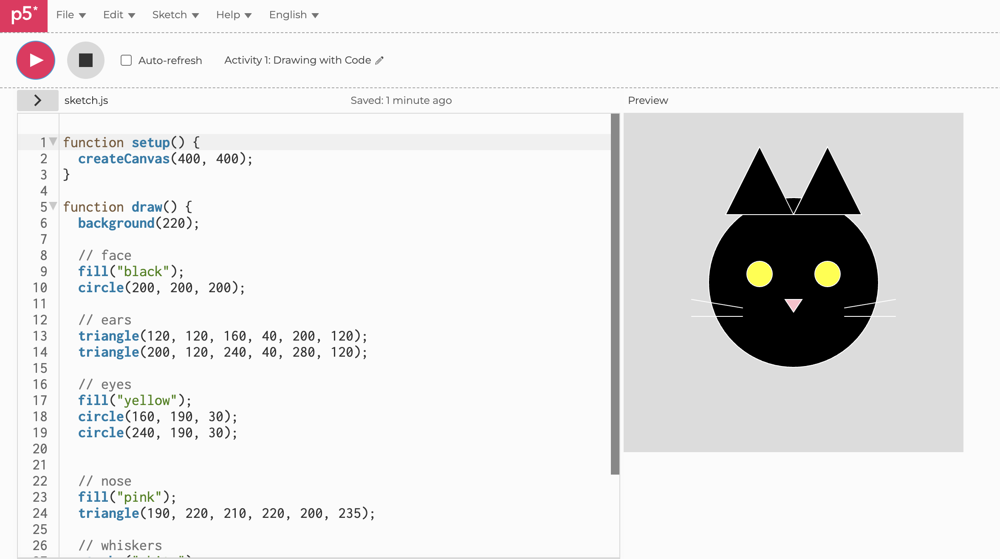
*Figure 9: personal practice 3*

The coordinate system was sometimes confusing, especially in understanding x, y, width, and height, and the coordinate points used in triangle shapes. However, experimenting with the coordinate helped me understand how positioning works in p5.js.

When I was used to it, experimenting with colour, size, and position was enjoyable. I also discovered that p5.js renders shapes in the order they are written. This helped me understand how layering works in digital drawing.

### Activity 2: Make an Interactive Sketch

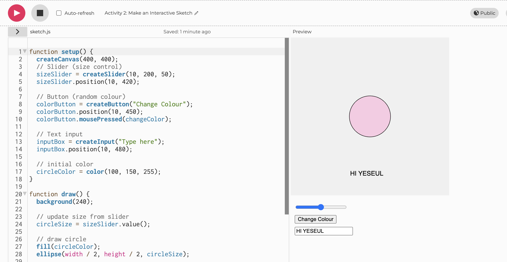

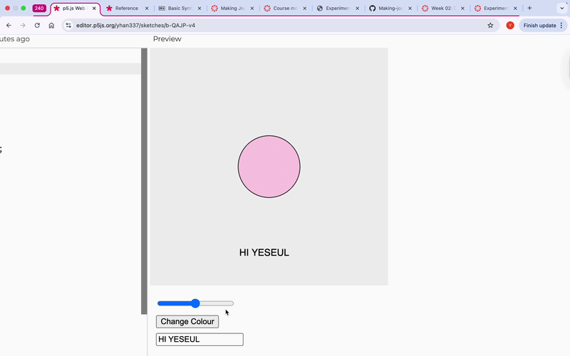

*Figure 10: Interactive Sketch*

I used DOM elements (createButton(), createSlider(), createInput()) to create an interactive sketch. The slider controlled the size of a circle, the button changed the colour, and the text input displayed text on the screen. It taked many time, but this experiment was valuable to learn the drawing interaction that I had never done before.

### Activity 3: Make an Interactive Sketch

In this activity, I used an LLM to help me create a generative interactive sketch in p5.js.

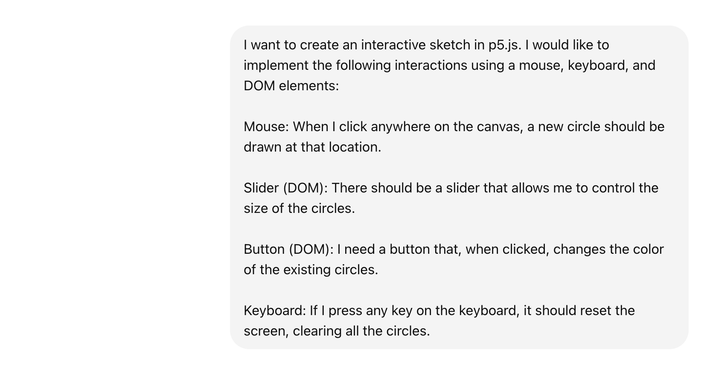

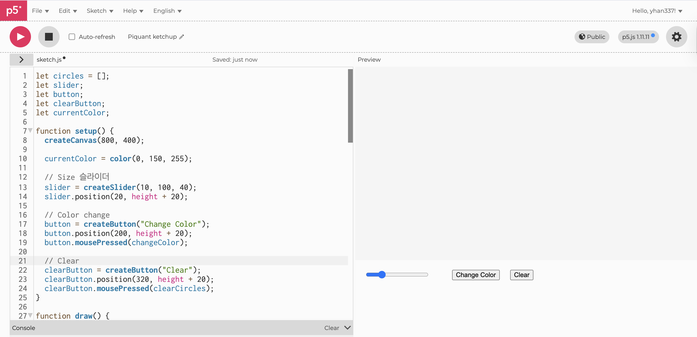
*Figure 11: Interactive Sketch Code using LLM*

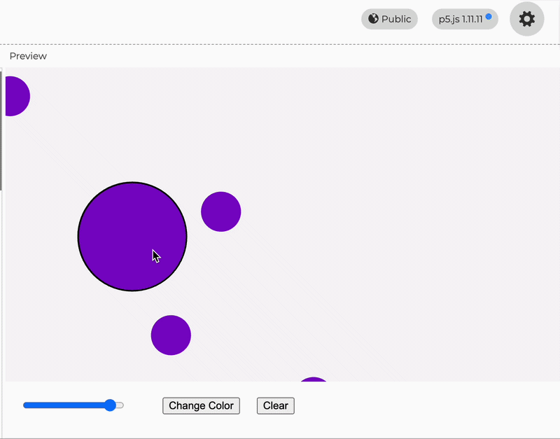
*Figure 11: Vibe Code an Interactive Sketch*

I decided to create a sketch that stamps circles onto the canvas using the mouse. I asked GPT and got the code, and instead of copying it, I tried to type the code myself and understand it further. When something did not work, I asked the AI to explain the problem and help me fix it. 

After I successfully created the basic circle stamping sketch, I added more features step by step. ( 1. Hover Interaction, 2. Animation, 3. Fade Trail / Motion)  I also included UI elements such as a clear button and color change. This made the circles feel more responsive and alive rather than static shapes, and feel more like an interactive tool rather than just a drawing program.

## Independent Study: Interactive Data Portrait

For this independent study, I made an interactive p5.js sketch based on my Experiment 1 data.

#### Step 1: Translate your data drawing into code

I focused on three aspects from my hand-drawn data portrait: device type, emotion, and intensity. These variables are both visually distinctive :

1. Device type: Phone, Laptop, AirPods
→ represented by different shapes: circle, square, and triangle.
2. Emotion : Anxiety/Irritated, Regretful/Empty, Blank, Calm/Relieved, Content
→ represented by color (red, grey, yellow, blue, green).
3. Intensity:  a numeric variable (scale 1–5)
→ represented by the size of the shape.

#### Step 2: Design your interactive visualisation

In Experiment 1 (paper drawings), I used a spiral structure to show how the data flows over time. However, when I focused on emotional and Intensity data, I created a design where shapes build up. This helps capture the emotional transition that occurs when letting go of a device. By stacking the data, it reveals not only the initial psychological pressure but also the sense of relief and emotional clarity that builds up as I successfully distance myself from digital distractions.

I designed three key interactive elements to give viewers control over the data:

Text Input: Allows users to type a specific day (Sun-Sat) to explore the emotional layers of that day individually.

Buttons: Provides an intuitive way to select devices and emotions, lowering the barrier for data entry.

Slider: Enables users to adjust emotion intensity on a scale of 1-5, which is reflected in the size of the shapes.

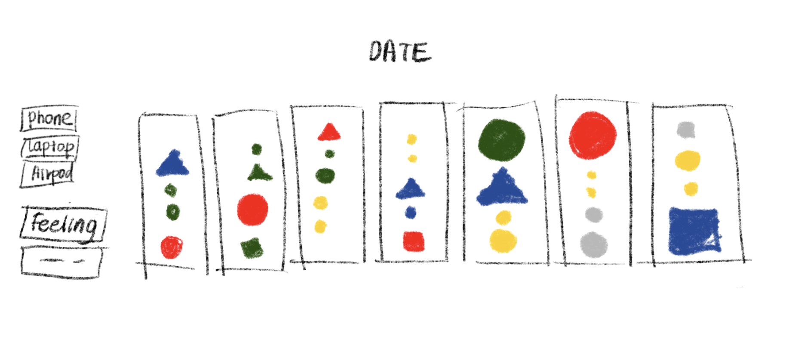
*Figure : Early Interface Sketch*

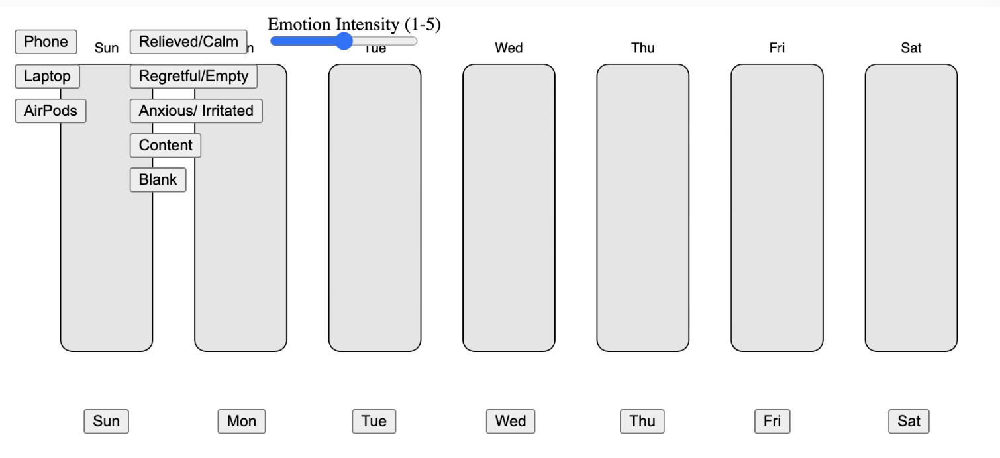
*Figure : Initial Iteration*

My initial design was to have the 7-day rectangle bar fully visible and to include data. However, the 7-day bar layout did not provide enough space to display the shapes effectively and felt overly cluttered. Therefore, I simplified the interface from seven to a single large canvas, allowing for the input of the date to record data.

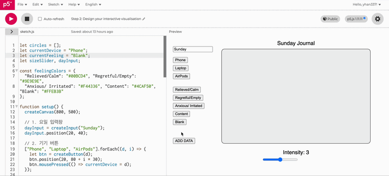
*Figure : Initial Prototype*

Building upon my initial design, I completed a prototype with a single-canvas interface. On the left, I placed device and emotion buttons, along with an intensity slider (1-5) below, enabling users to easily represent their feelings after putting down their devices for the day.

To create an interaction where shapes stack from bottom to top, I sought assistance from an LLM (GPT). However, I felt some limitations. Although not shown in the gif, the shapes would unfortunately continue to be recorded even when they exceeded the bounds of the canvas. In a future iteration, I would like to implement a scroll" feature or a clear canvas constraint to manage this overflow more gracefully.

My hand-drawn portrait shows the overall data flow, but it is static. The interactive sketch shows the stacking shapes from bottom to top as new data is added. This shows how emotions build up when I keep picking up my device.

#### Step 3: Iterate

*Figure : Initial Prototype*

I explained my interaction and its purpose to a friend, who then tested the sketch and provided feedback. They observed that the previous "stacking" method left too much empty space on the canvas. Since my data focuses more on the emotional state rather than time sequence, she suggested allowing the shapes to be placed freely across the canvas to create a more immersive visual experience.

I agreed with this perspective and redesigned the sketch to allow for random placement within the canvas. I also added outlines to each shape to be distinguished by outlines, even if they overlap. This iteration makes the canvas feel much more vibrant compared to the previous version.

One issue is that because the shapes are placed randomly, newer shapes occasionally overlap and obscure previous data points. While I am satisfied with the increased visual density, I would like to further develop the code in the future: prevent shapes from overlapping, or use physics-based animations where shapes gently bounce off one another.

This iteration process helped me understand that interaction design is not only about making something interactive, but about how interaction changes the way data is experienced and interpreted by the viewer.

### AI Usage Statement

Tools Used: ChatGPT (OpenAI)