# Experiment 3: Live Data

[← Back to Home](../index.md)

## In-Class Activity

### Activity 1: Explore with cURL

To complete Activity 1, I explored the documentation and GitHub repositories for wttr. in and the Free Dictionary API using the terminal.

#### 1. Get the weather for a location using its GPS coordinates

I used the command *curl wttr.in/Korea* to retrieve this data.

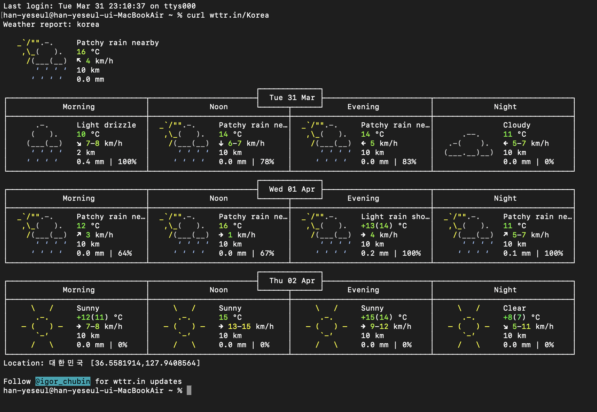
*Figure 1: Weather for Korea*

#### 2. Get the weather in a different language

Firstly, I used *curl wttr.in/Seoul?lang=ko* this command, but Terminal can't match found, so I used *curl -H "Accept-Language: ko" wttr.in/Seoul.*

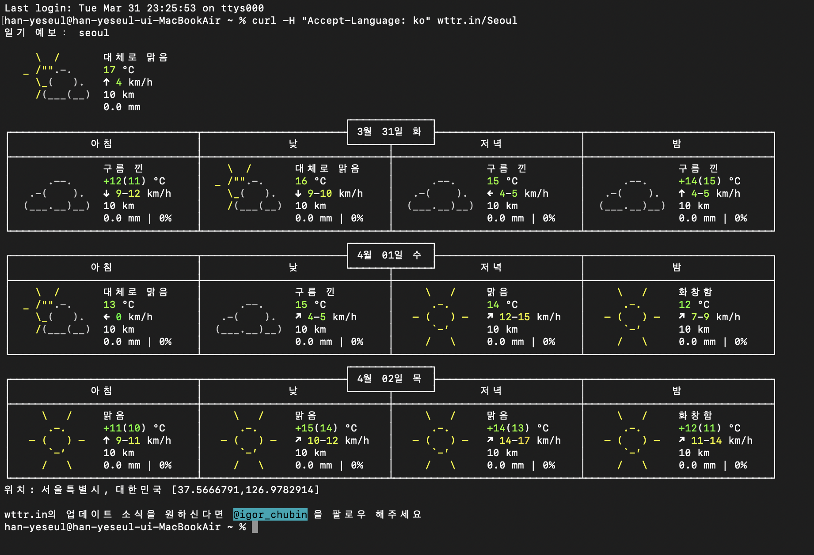
*Figure 2: Weather for Korean*

#### 3. Get the current moon phase

I used the command *curl wttr.in/Moon* to get the current moon phase.

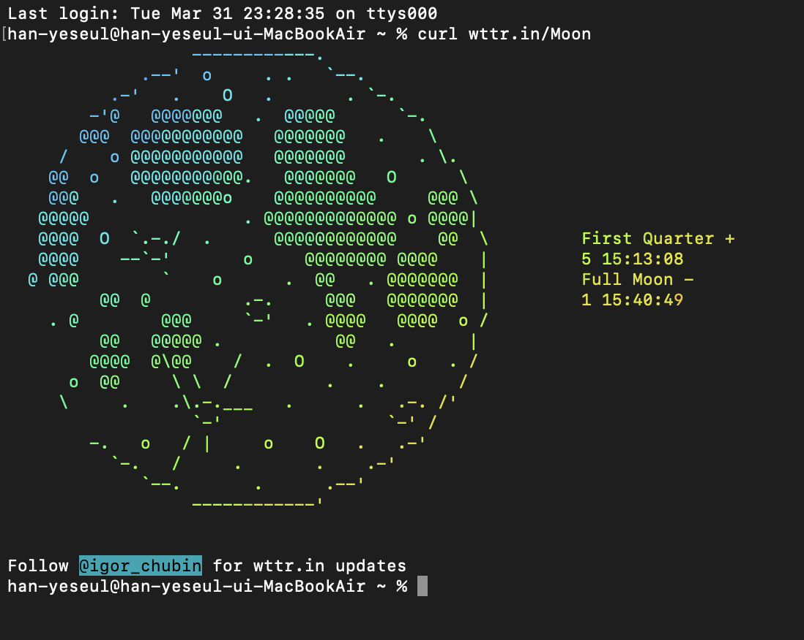
*Figure 3: Current moon phase*

#### 4. Look up the synonyms and antonyms of a word

Using this command *https://api.dictionaryapi.dev/api/v2/entries/en/word* and added the word sad.

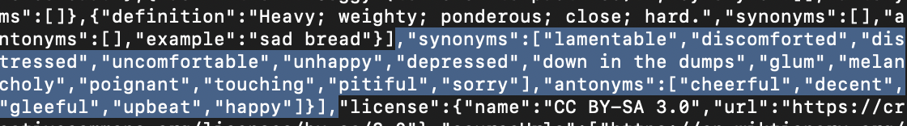
*Figure 4: Synonyms and antonyms*

#### 5. Find something else in the documentation that we haven't covered

To go beyond the basic functions, I explored the documentation and discovered how to generate weather data as a PNG image using *curl wttr.in/Auckland.png*.

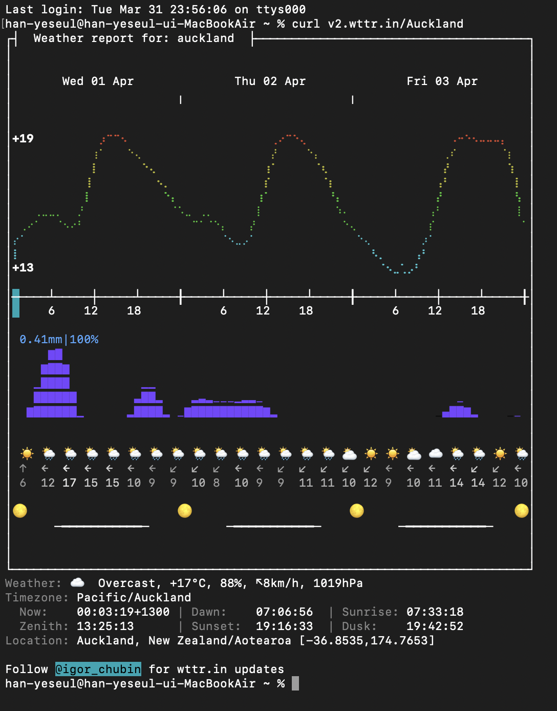
*Figure 5: Demo Skecth*

### Activity 2: Weather Visualisation

This activity is to experiment with this sketch.

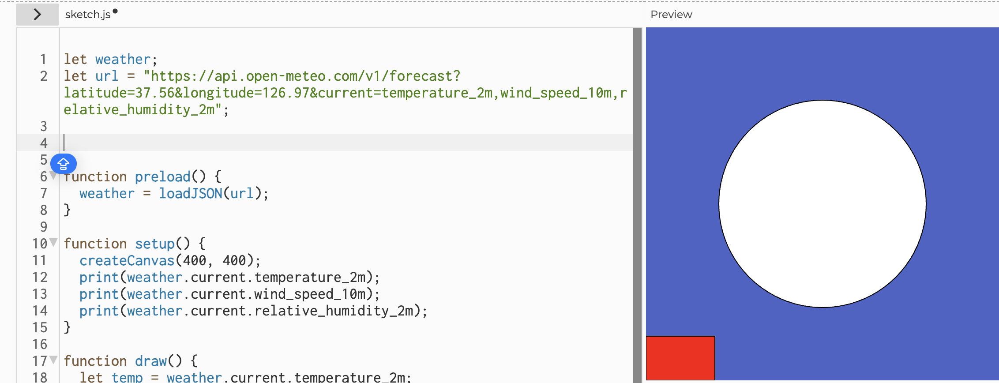
*Figure 6: Auckland weather data as a PNG image*

#### 1. Change the latitude and longitude to a different city

*Figure 7: API UPL of Seoul, current wind speed, temperature and humidity*

I first updated the OPEN Meteo API UPL with the coordinates for Seoul (Latitude: 37.56, Longitude: 126.97).  Even slight changes,  but it was interesting to observe how the sketch shifts based on a different context

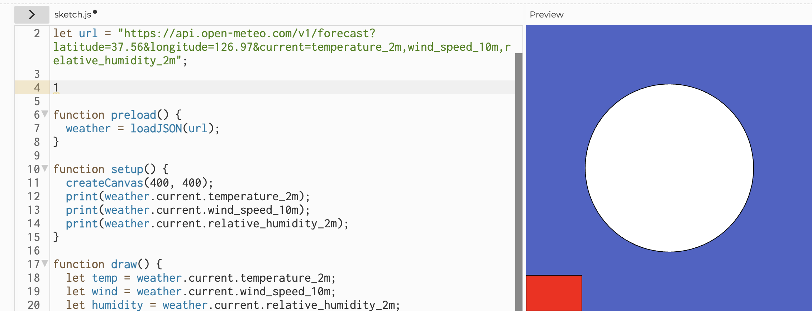
*Figure 8: Seoul Latitude/ Longitute*

#### 2. Use the data to control different visual properties

I mapped real-time weather measures to specific visual elements to create a data-driven composition.

I used the "temperature_2m" data to show the diameter of the orange circle. By using the **map()** function, I ensured that as the temperature rises, the circle expands, visually representing heat intensity.

**Colour:** 
The background hue was linked to the "relative_humidity_2m." Higher humidity levels create the canvas for cooler, deeper blue tones. While lower humidity creates a brighter, airier atmosphere. Instead of using color names, I used RGBA values in the fill() function. This allowed me to control the visual by adjusting transparency (Alpha) and dynamically linking color to environmental data for a more responsive design.

**Position of Shapes:** I used "wind_speed_10m" to control the length of a rectangular bar at the bottom of the canvas. It acts like a wind gauge that grows as the breeze picks up.

#### 3. Add more weather variables 

I expanded the API URL to fetch relative"_humidity_2m" and "wind_speed_10m" in addition to temperature. 

#### 4. Using random() or noise()

I introduced organic movement by combining live data with the **random()** function. I used the wind speed value to determine the intensity of a 'shaking' effect on the shapes.(let shaking = random(-wind, wind))

#### 5. Use vibe coding

I applied 'vibe coding' to shift the focus from a literal data display to an atmospheric representation. I linked the "relative_humidity_2m" to the background color (200 - humidity), allowing the overall mood of the canvas to shift between warm and cool tones based on the air's moisture. 

#### Final Weather Visualisation

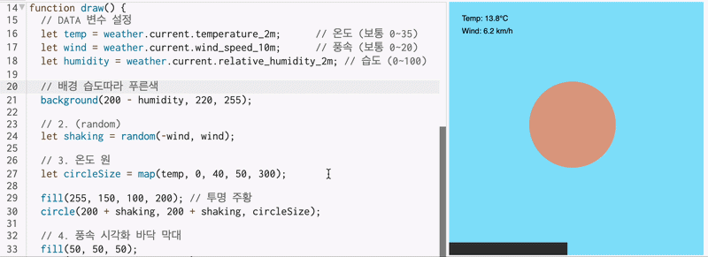
*Figure 9: Final Weather Visualisation*

### Activity 3: Design and Execute a Data Protocol

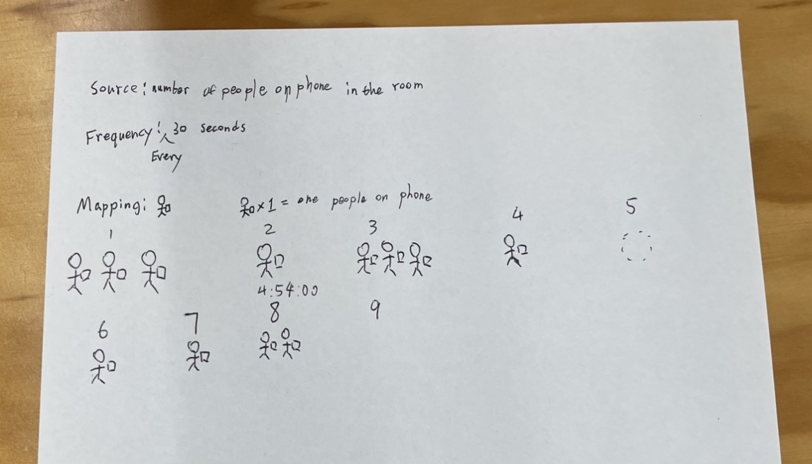
*Figure 10: Our Group data protocol*

We designed a protocol to map the physical presence of digital engagement in the room.

**Source:** The number of people actively using a phone in the immediate environment.

**Frequency:**** Every 30 seconds.

**Mapping:**** Each observation is recorded as a pictogram: a stick figure holding a rectangle (phone). One figure equals one person on a phone. 

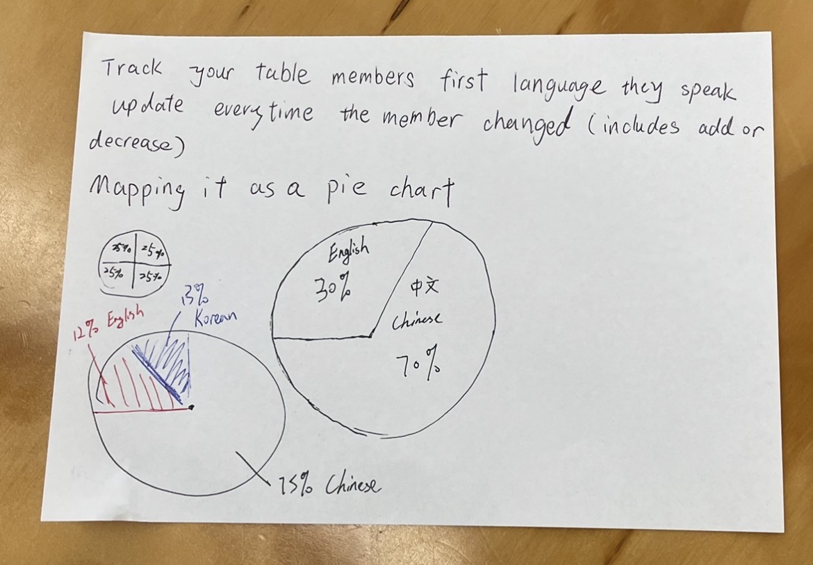
*Figure 11: Other Group data protocol*

#### Executing the Swapped Protocol: Language Diversity Pie Chart

We received a protocol from another group that asked us to track the first language spoken by our table members.

**Rules:** Update the data every time the member count changed (add or decrease).

**Mapping:** Visualize the data as a pie chart.

#### Reflection on the Execution:

Generally, we were able to follow the core instruction of mapping languages to a pie chart. We identified speakers of English, Korean, and Chinese at our table. (Also other team interpreted each our rules as expected.) The use of a simple pictogram made the data request universally understandable which mirror how a clear API call yields a predictable response.

However, the protocol was ambiguous regarding how to handle updates. The instruction said to update "every time the member changed," but it didn't specify whether to draw a new pie chart for each change.  We chose to draw separate charts to show the data over time. (as seen in the resulting sketch) 

The biggest surprise was the difficulty of calculating percentages on the fly for a hand-drawn pie chart. It was also hard to determine the percentage that our table was 13% Korean, 12% English, and 75% Chinese, and then accurately dividing a circle without a protractor was challenging. 

## Independent Study: Live Data Visualisation

#### 1. Approach: Digital (p5.js & API)

I chose a digital for this project because it allows for immediate and generative responses to continuous data. This method effectively captures the "rhythm" of live information, which static or analogue materials might miss. Using p5.js helped me transform abstract, numerical weather data into a tangible visual experience. Furthermore, digital also reflects modern life. People rely on digital technology every day, so this medium felt more relevant to how we experience information today. It helps connect raw data with our digital lifestyle.

#### 2. Data Source: Open-Meteo API (Auckland Weather)

I utilized the Open-Meteo API to fetch current weather data (temperature and wind speed) specifically for Auckland, New Zealand.

*Figure 12: API UPL of Auckland, current wind speed, temperature and humidity*

#### 3. Mapping & Communication

My goal was to create a visual that feels like the weather in Auckland.

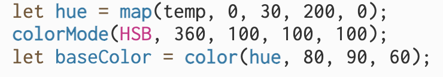
*Figure 13:HSB*
Temperature to Color Gradient (HSB Hue): Higher temperatures are mapped to warmer hues (red/orange), while lower temperatures shift to cooler hues (blue/green). This intuitive mapping communicates the temperature feel of the day.

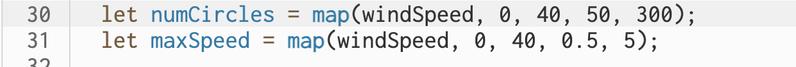
*Figure 14: Wind speed code*
Wind Speed: Wind speed controls how fast the shapes move across the canvas and how many shapes appear. Stronger wind creates faster and more crowded movement, which helps show the energy of the wind better than numbers alone.

#### 4. Tools & Learning (Vibe Coding with LLMs)

I used ChatGPT (OpenAI) and Gemini (Google) as collaborative "Vibe Coding" partners to implement the p5.js logic. 

I learned how to set up the API fetch function using loadJSON() to get live data. I also used the **map()** function to convert temperature and wind speed into visual elements like colour and movement speed. Finally, I created continuous movement and wrap-around logic so the shapes move smoothly across the screen.

Through this process, I learned how to read live **JSON data** from an external source and use it inside the **draw()** loop. This allowed me to create a dynamic digital portrait that updates automatically with live data.

#### 5. Relation to Practitioners

My work relates to the philosophy of the Conditional Design group. In their work, the rules and process are set first, but the final result is unpredictable because it depends on external data or conditions. My project also relates to data artists like Jer Thorp, who turn raw data into emotional and meaningful visual experiences. Similarly, my project transforms weather data into a visual and emotional digital environment.

#### 6. Future Development

If I had more time, I would add sound using "p5.sound" so that wind speed data could be heard as well as seen. Which is to create a multi-sensory experience. Also, I would like to add historical weather data together with current data so users can compare past and current weather patterns.

### AI Usage Statement

Tools Used: ChatGPT (OpenAI), Gemini (OpenAI)
