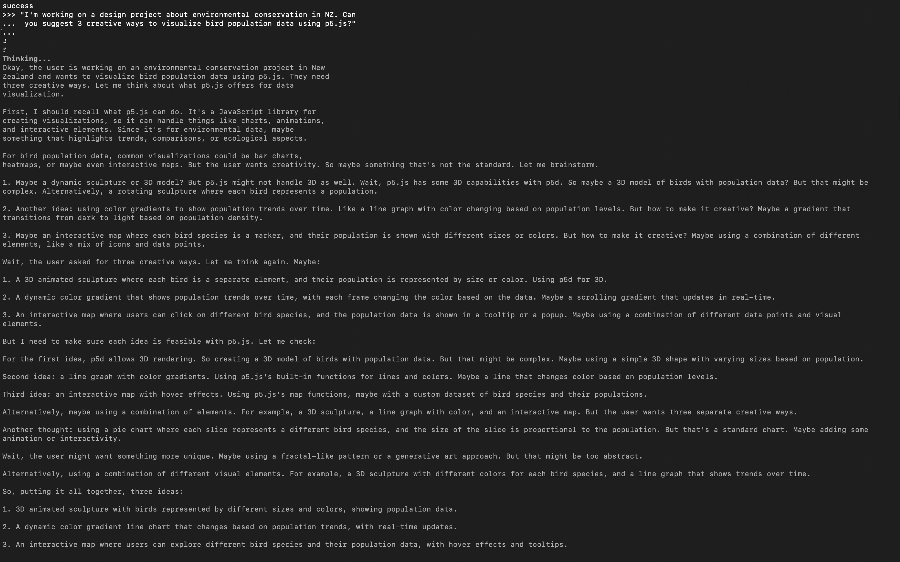
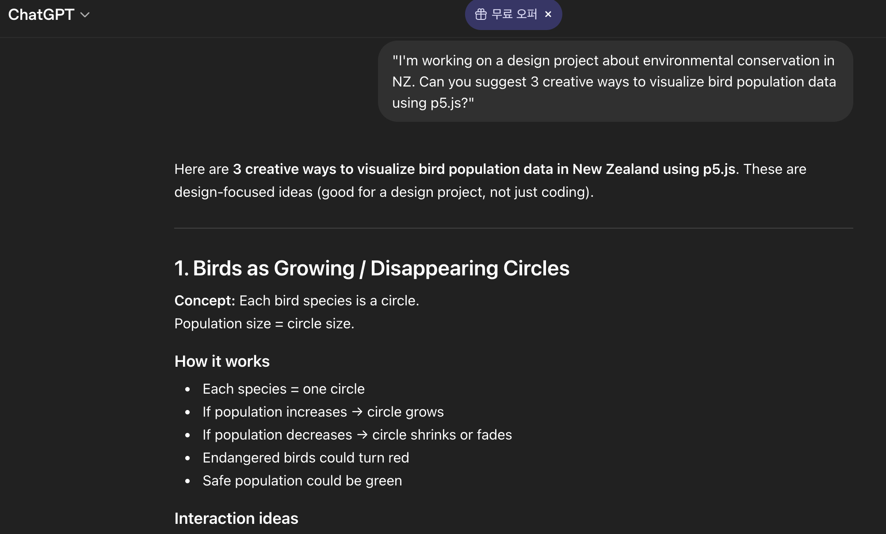
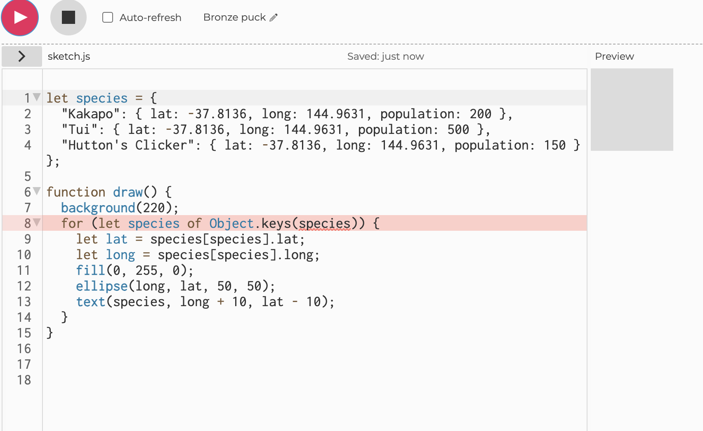
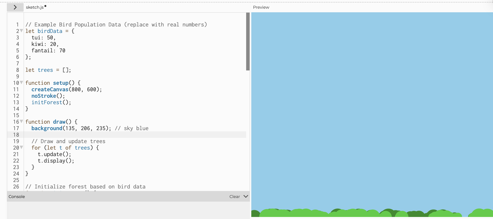
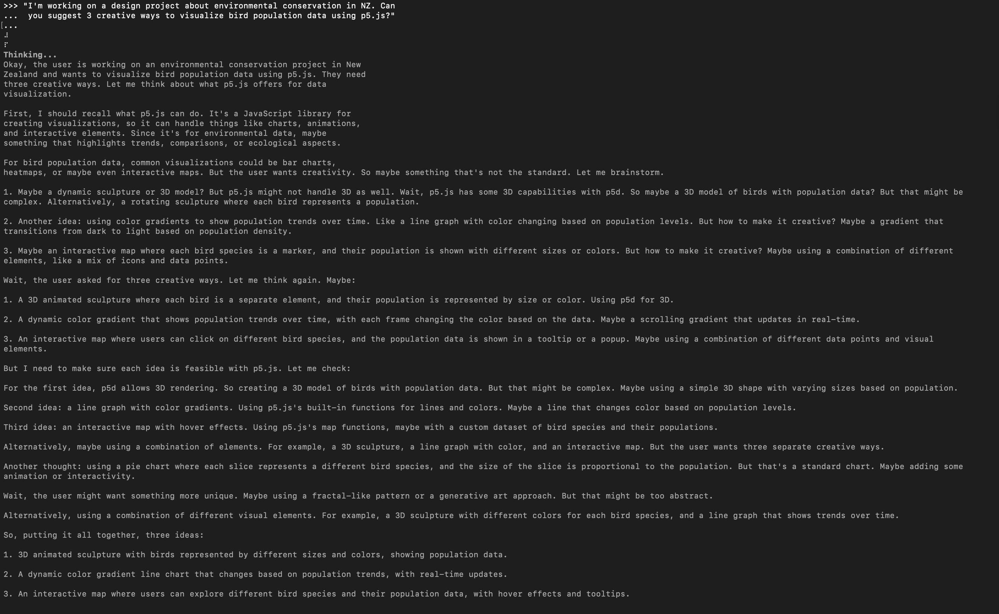

# Experiment 4: Artificial Intelligence

[← Back to Home](../index.md)

## In-Class Activity

### Activity 1: Local AI with Ollama

For this activity, I explored the workflow of running a local Large Language Model (LLM) using Ollama. I installed the Qwen3:1.7b model and interacted with it via the terminal. Unlike cloud-based AI like ChatGPT, this model operates entirely on my BYOD laptop.

#### The Interaction 

I tested the model by describing my previous design experiments and asking for visualization ideas. Specifically, I asked for:

*Figure 1: Question one answer of Ollama*

*Figure 2: Question one answer of GPT*

Creative Visualization: I requested ideas for representing bird population data in New Zealand using p5.js. 

Question both Ollama and GPT - "I'm working on a design project about environmental conservation in NZ. Can you suggest 3 creative ways to visualize bird population data using p5.js?"

Code Generation: I asked the model to write a responsive p5.js script that reflects the "psychological build-up of digital data" through organic shapes.

Comparison: I compared its responses to a standard cloud-based LLM: GPT.

#### Critical Reflection

## Speed and Latency ##

The model responded quickly at first, but it was not as smooth or fast as cloud-based models. Compared to other AI models, it was noticeably slower and sometimes had delays when generating responses. Also, it made all my taps slow and laggy. This affected the workflow because the interaction felt less fluid.

## Quality vs. Capability## 

*Figure 3: Ollama Coding Fail*
 

*Figure 4: GPT Coding*

The Qwen3:1.7b model is smaller, so it had difficulty with complex design ideas compared to larger models. Also, the code that it suggest are not working due to some error. This highlights the gap in Capability. While the local model is surprisingly good at brainstorming and design assistance, its knowledge base is less grounded in factual accuracy compared to massive cloud-based models. As a designer, this means I must use local AI as a collaborative sketchpad rather than a primary source of technical truth. I had to critically filter its suggestions, keeping the creative ideas but correcting the technical implementation.

## Sovereignty vs. Capability Trade-off ##

The most important idea I learned was data sovereignty. Using a local model felt more secure because my ideas and data were not shared with large companies. The trade-off is that I lost some accuracy and knowledge, but I gained privacy and a safe space to experiment without worrying about data use. The most striking part of the experiment was seeing the "Thinking..." process happen entirely on my hardware. There was no "Saving data" message. This interaction felt significantly more intimate and secure.

### Activity 1: Local AI with Ollama

## Images & Media

*Use the format below to embed images from your assets folder:*

``
`*Your caption here*`

*The text inside the square brackets is alt text (a description for accessibility), not a visible caption. To add a caption, place a line of italic text below the image.*

## AI Usage Statement

*Document any use of AI tools under an AI Usage Statement heading. Explain which tools you used and describe how you used them. Reference any AI-generated content (see [QuickCite](https://auckland.libguides.com/referencing-generative-ai-tools) for guidance).*

*Figure 2: Question two answer of Ollama*

### AI Usage Statement

Tools Used: ChatGPT (OpenAI), Gemini (OpenAI)
