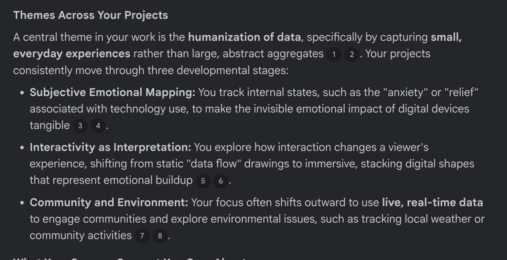
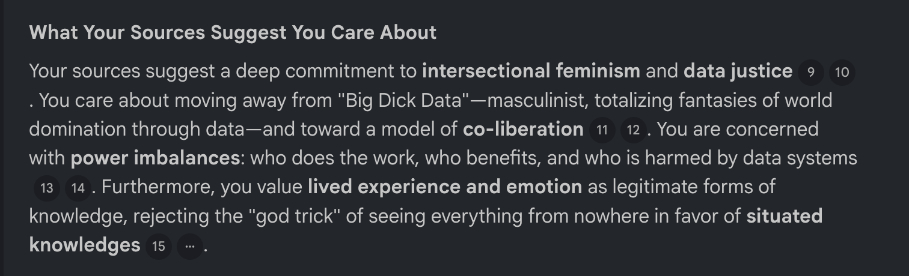
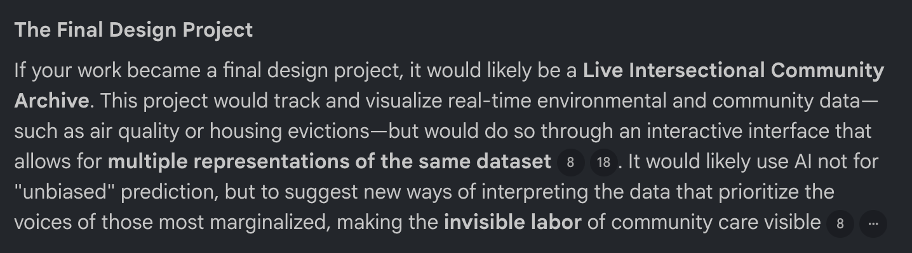
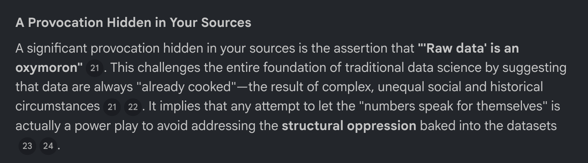
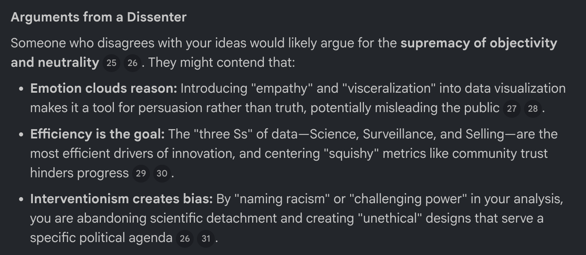
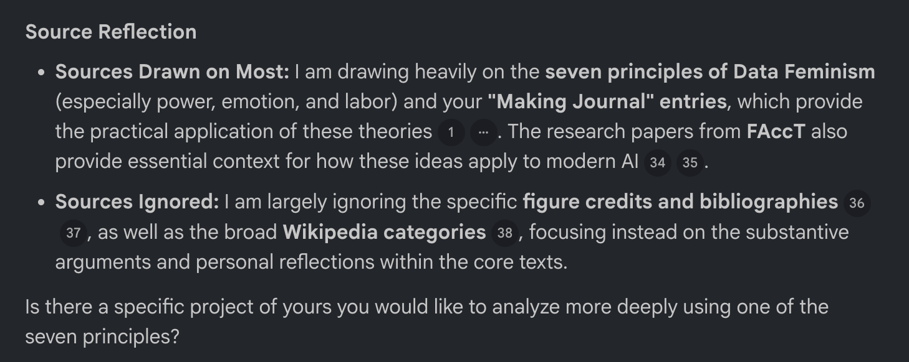

# Experiment 4: Artificial Intelligence

[← Back to Home](../index.md)

## In-Class Activity

### Activity 1: Local AI with Ollama

For this activity, I explored the workflow of running a local Large Language Model (LLM) using Ollama. I installed the Qwen3:1.7b model and interacted with it via the terminal. Unlike cloud-based AI like ChatGPT, this model operates entirely on my BYOD laptop.

#### The Interaction 

I tested the model by describing my previous design experiments and asking for visualization ideas. Specifically, I asked for:

*Figure 1: Question one answer of Ollama*

*Figure 2: Question one answer of GPT*

Creative Visualization: I requested ideas for representing bird population data in New Zealand using p5.js. 

Question both Ollama and GPT - "I'm working on a design project about environmental conservation in NZ. Can you suggest 3 creative ways to visualize bird population data using p5.js?"

Code Generation: I asked the model to write a responsive p5.js script that reflects the "psychological build-up of digital data" through organic shapes.

Comparison: I compared its responses to a standard cloud-based LLM: GPT.

#### Critical Reflection

**Speed and Latency**: The local model (Ollama) responded quickly at first, but it was not as smooth or fast as cloud-based models. Compared to other AI models, it was noticeably slower and sometimes had delays when generating responses. Also, it made all my taps slow and laggy. This affected the workflow because the interaction felt less fluid.

**Quality vs. Capability**: 

*Figure 3: Ollama Coding: error*
 

*Figure 4: GPT Coding: not working*

The Qwen3:1.7b model (Ollama) is smaller, so it had difficulty with complex design ideas compared to larger models. Also, the code that it suggest are not working due to some error. This highlights the gap in Capability. While the local model is surprisingly good at brainstorming and design assistance, its knowledge base is less grounded in factual accuracy compared to massive cloud-based models. However, when I asked ChatGPT to code a visualization of the bird population, it suggested code that working mapping each bird species to a tree color and controlling the population with key inputs. However, when I added the code to p5.js, these interactions did not work as expected. This showed a gap between the AI’s idea and the actual p5.js code. It focused more on explaining the idea than making the code work, so I had to fix the code myself. This means as a designer, I must use either local or cloud AI as a collaborative sketchpad rather than a primary source of technical truth. I had to critically filter its suggestions, keeping the creative ideas but correcting the technical implementation.

**Sovereignty vs. Capability Trade-off**: The most important idea I learned was data sovereignty. Using a local model felt more secure because my ideas and data were not shared with large companies. The trade-off is that I lost some accuracy and knowledge, but I gained privacy and a safe space to experiment without worrying about data use. The most striking part of the experiment was seeing the "Thinking..." process happen entirely on my hardware. There was no "Saving data" message. This interaction felt significantly more intimate and secure.

### Activity 2: Cloud AI with NotebookLM

#### Building the Notebook (Sources)

*Figure 5: Upload rources to my NotenookLM*

I added the following sources to my NotebookLM notebook:

- Making Journal GitHub Pages – documentation of Experiments 1–3
- Experiments 1–3 Documentation – detailed notes, sketches, p5.js code, and reflections.
- Kirikowhai Mikaere YouTube Video – a talk on Māori data sovereignty.
- How we can find ourselves in data | Giorgia Lupi - YouTube
- Data Feminism (Catherine D’Ignazio & Lauren F. Klein) – open-access book introducing critical perspectives on data, power, and representation.

I shared my projects, datasets, videos, and readings with the AI to give it context, show the world and Indigenous perspectives, highlight issues like data bias, and inspire ideas for interactive visualisations.

#### Context Document

The context.md file included the following content:

1. The experiment I found most interesting was Experiment 3: Live Data, because it allowed me to track and visualise real-time information about environmental and community activities.  

2. A theme I keep coming back to in my projects is the use of data to engage communities and explore environmental issues, particularly through interactive visualisations.  

3. I am curious about how AI can generate multiple representations of the same dataset and suggest new ways of visualising or interpreting it.

I highlighted my most interesting experiment to show the AI which part of my work was most important. I pointed out a recurring theme: community engagement, environmental data, and interactivity to help the AI see patterns across my sources. I also asked a curious question about generating multiple visualisations to encourage creative ideas. Overall, this document helps NotebookLM understand my work clearly while leaving space for the AI to suggest new connections and insights.

#### Chat Exploration

I asked NotebookLM questions :

- What themes appear across my projects?
- What do my sources suggest I care about?
- If my work became a final design project, what would it be?
- Identify a provocation hidden in my sources.
- What would someone who disagrees with my ideas argue?
- Which sources are you drawing on most, and which are you ignoring?

AI Insights on My Work :

**Themes Across My Projects**

*Figure 6: Themes Across Your Projects*

**What My Sources Suggest I Care About**

*Figure 7: What My Sources Suggest I Care About*

**Final Design Project**

*Figure 8: The Final Design Project*

**A Provocation Hidden in Your Sources**

*Figure 9: A Provocation Hidden in Your Sources*

**Arguments from a Dissenter**

*Figure 10: Arguments from a Dissenter*

**Source Reflection**

*Figure 11: Source Reflection*

어떤 질문 했는지
AI가 뭐라고 했는지
놀라웠던 점 / 틀린 점

The NotebookLM surprised me by connecting experiments I hadn’t linked and highlighting ethical questions, but it also made mistakes, assuming some data was neutral and suggesting visualisations that were impractical for the dataset.

#### Audio Overview

들으면서 느낀 점
Chat과 Audio 차이

#### Reflection
AI가 내 작업을 어떻게 해석했는지
AI 사용하면서 느낀 점
AI는 collaborator인지 tool인지
AI bias / limitations

## Images & Media

*Use the format below to embed images from your assets folder:*

``
`*Your caption here*`

*The text inside the square brackets is alt text (a description for accessibility), not a visible caption. To add a caption, place a line of italic text below the image.*

## AI Usage Statement

*Document any use of AI tools under an AI Usage Statement heading. Explain which tools you used and describe how you used them. Reference any AI-generated content (see [QuickCite](https://auckland.libguides.com/referencing-generative-ai-tools) for guidance).*

### AI Usage Statement

Tools Used: ChatGPT (OpenAI), Gemini (OpenAI)
