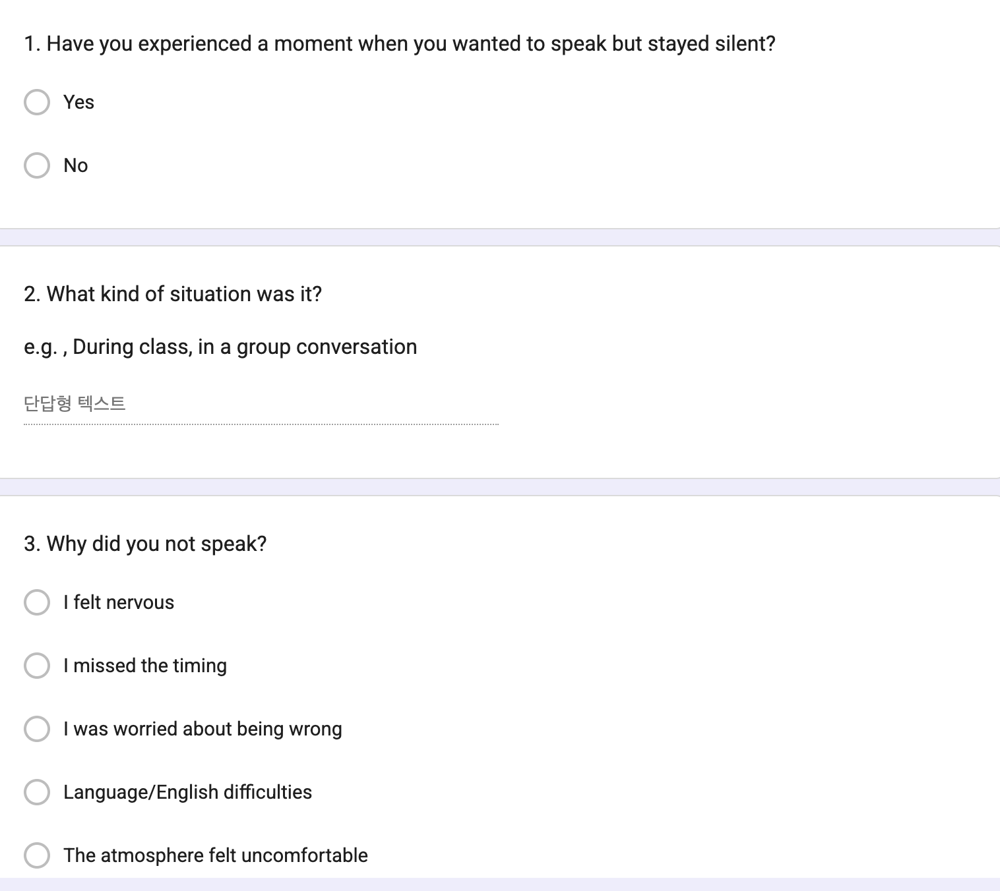
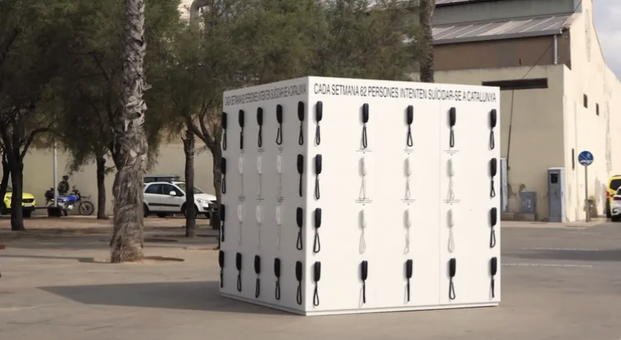
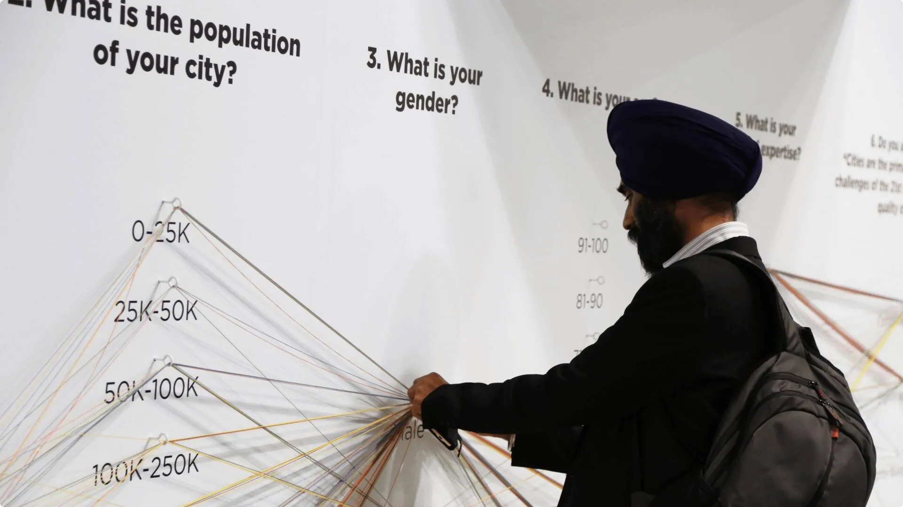
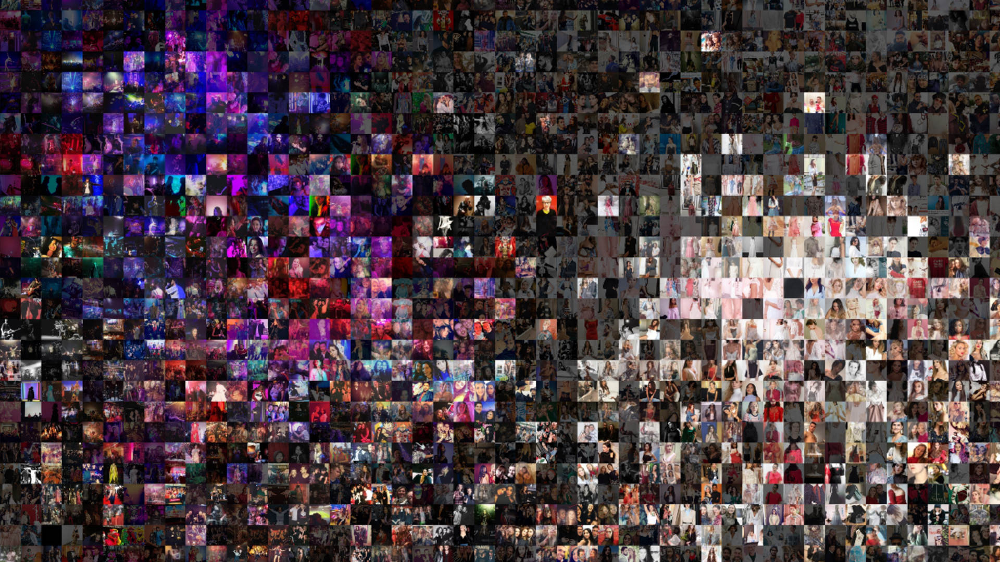
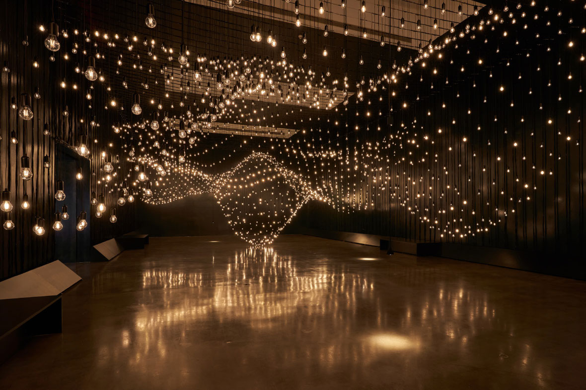
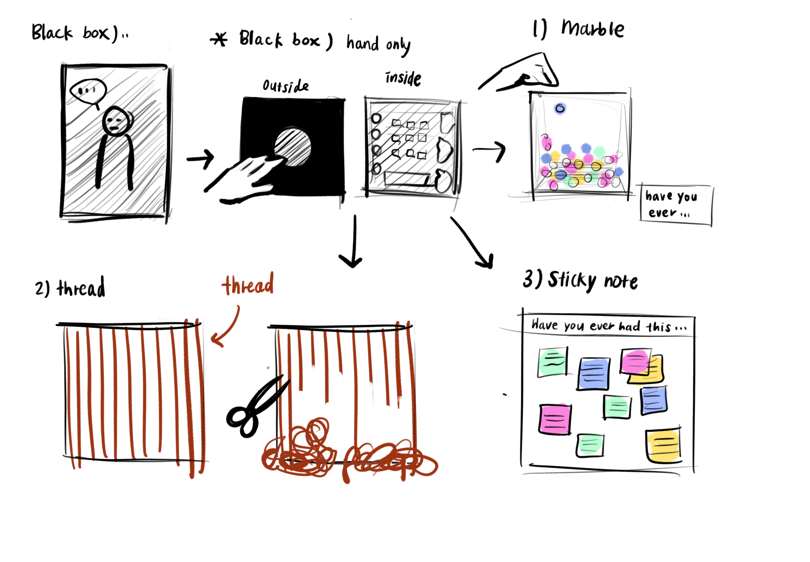
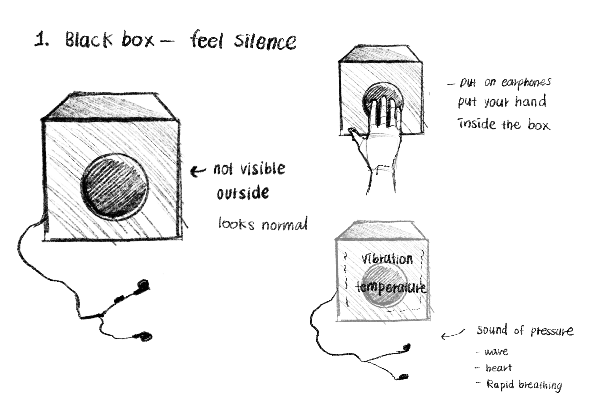
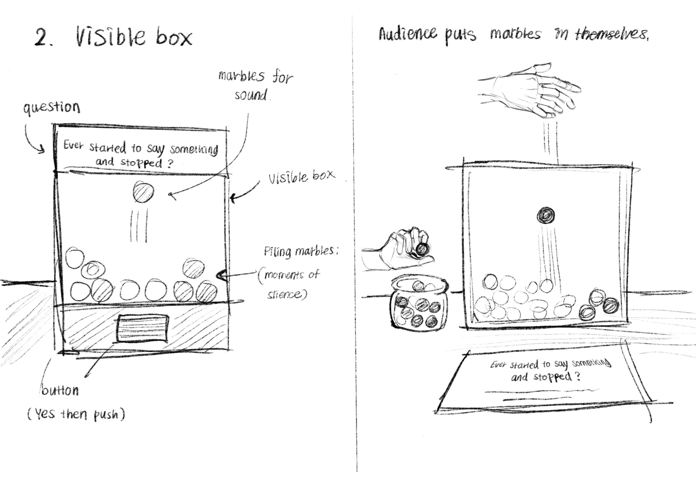

# Week 06

[← Back to Home](../index.md)

# Data Physicalisation Project – Invisible Participation

## In-Class Activities

## 1. Data Exploration

### 1.1 Data source and where it comes from

This project uses original qualitative data collected through a Google Forms survey. The participants are **university students, especially international and multilingual students.** Instead of using an existing dataset, I am generating new data based on lived experiences of communication, silence, hesitation, and emotional expression in social and educational environments.

Participants are asked to reflect on moments when they wanted to speak but stayed silent and describe the emotions they experienced in those moments. They are also asked to translate emotions into tactile descriptions (e.g., “If this emotion were a physical texture, what would it feel like?”). This allows emotional experiences to be treated as sensory data.

All responses are self-reported, meaning the data reflects personal memory and interpretation rather than objective measurement. The purpose is to understand silence not as absence, but as a meaningful form of participation.

*Figure 1. Survey of Invisible Participation: Moments Left Unsaid*

Survey link:  
https://docs.google.com/forms/d/e/1FAIpQLScAG5ZGfqNMFd6py6UuLPzl3GByW6cVff_1xJmFDg6OFGS_QQ/viewform?usp=dialog

---

### 1.2 What the data contains and how it is structured

The dataset contains short written responses describing emotional and social experiences.

**Key questions include:**  
- Have you ever stayed silent when you wanted to speak?
- What emotion did you feel most strongly?
- How would you describe the moment in one sentence?
- What does that emotion feel like physically or tactually?
- How would you classify this moment of silence?

**The data is qualitative (non-numerical) and organised into themes:** 
- Emotional responses (anxiety, embarrassment, loneliness, frustration)
- Communication barriers
- Silence and hesitation experiences
- Belonging and participation
- Tactile interpretations of emotions

As more responses are collected, patterns of “invisible participation” begin to emerge.

---

### 1.3 Limitations, biases, and gaps

A key limitation is that the data relies on self-reporting. Participants interpret and remember experiences differently, which makes the data subjective rather than factual.

Participation is also voluntary, meaning the dataset may over-represent people who strongly relate to silence or communication difficulty.

Another limitation is cultural and linguistic differences. Silence and hesitation can mean different things depending on language ability, personality, and cultural context, making comparison difficult.

Finally, written responses cannot fully capture bodily or non-verbal emotional experiences.

However, these limitations are not treated as problems to fix. Instead, they become part of the design material. The ambiguity and incompleteness of the data are important qualities that reflect the nature of invisible participation.

---

## 2. Visual Research and Precedent Study

### 2.1 Giorgia Lupi – *Dear Data*

*Figure 2. Dear Data (Lupi, 2016)*

- **What draws me to it:**  
  Daily life experiences are translated into hand-drawn data visualisations rather than numbers.

- **What I carry forward:**  
  Qualitative experiences (emotions, behaviours, habits) can be encoded into visual symbols and systems.

- **Impact:**  
  Reinforces converting emotional experiences into structured visual data.
  
---

### 2.2 Domestic Data Streamers

*Figure 3. Conversations on Suicide by Domestic Data Stream.*

*Figure 4. Data Strings by Domestic Data Stream.*

- **What draws me to it:**  
  It transforms social and emotional data into physical, spatial installations.

- **What I carry forward:**  
  Data as an experiential and material storytelling medium.

- **Impact:**  
  Reinforces my intention to materialise emotional and qualitative data into physical accumulation systems.

---

### 2.3 Moritz Stefaner – *Truth & Beauty*

*Figure 5. Multiplicity by Moritz Stefaner, Truth & Beauty.*

- **What draws me to it?**
 It combines analytical clarity with emotional and aesthetic understanding of data.

- **What I carry forward**
 Data should be both informative and emotionally perceptible, not purely analytical.

- **Does it change/reinforce direction?**
 It strengthens my goal of making invisible emotional data feel visually and emotionally readable.

---

### 2.4 Rafael Lozano-Hemmer – *Pulse Room*

*Figure 6. Takes Your Pulse by Rafael Lozano-Hemmer*

- **What draws me to it:**  
  It translates each participant’s heartbeat into a physical light bulb that accumulates across space.

- **What I carry forward:**  
  Individual physiological data can become a collective spatial archive through repetition and accumulation.

- **Impact:**  
  It strongly reinforces my idea of transforming invisible internal states into physical spatial data.

---

### 2.5 Studio Ossidiana – Material Data Installations

*Figure 7. Cylindrical pavilion by Studio Ossidiana*

- **What draws me to it:**  
  It explores material systems where human interaction directly reshapes physical structures and spatial conditions.

- **What I carry forward:**  
  Physical materials can act as responsive data carriers that change through human participation.

- **Impact:**  
  It supports my approach of using physical tension and material change as a form of data visualisation.

---

## 3. Project Planning and Skills Roadmap

### 3.1 What do I need to make?

This project consists of two interconnected participatory systems.

*Figure 7. Idea sketch showing the relationship between the Black Box and the Transparent Accumulation System. Strings, beads, and Post-it notes are used to transform invisible participation into a visible physical dataset.*

#### 1. Sensory Black Box Interface (tactile input system)

*Figure 8. Sketch of Sensory Black Box Interface*

Participants interact with a black box by placing their hands inside it.

The black box functions as a sensory interface that symbolizes internal emotional states and silence that are not externally visible.

Participants wear headphones and experience audio-based stimuli such as heartbeats, breathing sounds, and low-frequency vibrations. At the same time, the box's internal materials (e.g., rough, soft, cold, or vibrating textures) allow participants to physically feel emotional states such as tension and anxiety within an externally “silent” black space.

This system expresses internal emotional states related to silence, tension, and unspoken thoughts through sensory input rather than visual representation.

#### 2. Transparent Accumulation System (physical data archive)

*Figure 9. Sketch of Transparent Accumulation System*

After the sensory experience, participants respond to questions about moments when they wanted to speak but remained silent.
Each response is translated into a physical object (beads or marble) and placed into a transparent container. Over time, these accumulated objects form a visible archive of silence. The use of marbles is intentional. As they accumulate, their weight and volume symbolise the “weight of unspoken words,” transforming silence into a tangible, physical form of emotional accumulation.

**System logic**
 The entire process follows this sequence:
 Sensory experience → emotional reflection → physical accumulation

This transforms invisible emotional states into a tactile and spatial data system, allowing collective emotional mapping to be visualized through participation.

---

### 3.2 What I need to learn

1. Interaction & Participation Design
 I will learn how to design flows that encourage participants to naturally engage and leave responses.
 → This ensures the system feels like an emotional experience rather than a task.

2. Sensory Interaction Techniques
 I will explore how emotions can be expressed through physical elements such as touch, vibration, material, and temperature.
 → This will inform how emotional data is translated into tactile experience.

3. Sound Research & Emotional Audio Design
 I want to study how heartbeats, breathing, low-frequency vibrations, and ambient sound influence emotion and tension, and how these can be applied to the black box experience.
 → This directly supports building an immersive sensory environment for the prototype.

4. Installation Fabrication Skills
 I will learn how to construct a black box and participatory structures using affordable materials.
 → This will directly support the creation of a functional physical prototype.

5. Qualitative Data Analysis
 I will analyze recurring emotional patterns in survey responses and organize them into a structured data system.
 → This strengthens the translation of emotional data into design decisions.

---

### 3.3 Next steps

The next step is to continue conducting surveys to collect more data related to “moments when people wanted to speak but remained silent.” After that, I will analyze emotional patterns and translate them into tactile elements such as texture, vibration, and material.

At the same time, I will begin building early prototypes of the black box and bead accumulation system using simple materials to test the participation flow.

---

## Independent Study

### 1. Consultation Reflection

During the project proposal consultation, the tutor noted that my initial concept had become overly complex because multiple ideas at once. In particular, the link between AI and reduced human communication was seen as underdeveloped, which weakened the clarity of the project’s focus.

The key feedback was the question of what I wanted the audience to feel. I initially aimed to evoke understanding and empathy, but this led me to separate emotional intention from data representation. As a result, I refined my focus toward visualising patterns of invisible participation through structured data.

I removed the AI and redefined the project around “invisible participation,” focusing on silence, hesitation, and non-response as forms of engagement within university learning environments, particularly among multilingual and international students.

Silence was reframed not as an emotional state but as a form of participatory data that can be observed and translated into physical outputs. 

This shift led me toward a data physicalisation approach, where unseen participation is made visible through material accumulation. 

This consultation became a key turning point in clarifying and simplifying my project direction, allowing me to focus on directly collected participatory data to visualise silence as a structured system.

---

### 2. Technical Skill Development

According to my technical roadmap, the first thing I needed was to understand how to transform qualitative data, such as emotions, into physical and interactive forms.
To explore this, I researched data visualization works where human actions result in tangible physical changes. In particular, I focused on systems in which small actions accumulate over time and gradually become visible as changes.

I also considered how emotional responses from my survey (such as silence, hesitation, and discomfort) could be translated into tactile experiences. I plan to further investigate this area and continue experimenting through feedback and iteration.
Through this process, I learned that the important thing is not the complexity of technology, but how effectively action and outcome are connected. I came to understand that when human actions result in physical change, this can function as a form of data visualization.

As a result, what began as a simple idea has developed into a more structured system. I also became more confident that a physical, material-based approach to interaction is more suitable for this project than digital.

---

### 3. Initial Concept Sketch

My initial concept sketch outlines the structure of a participatory installation that visualizes silence as physical data.
This sketch is not a final design, but a system prototype that tests how emotional data can be translated into physical form. It will continue to be developed and refined over time.

---

# References

- Lupi, G. (2016). *Dear Data*.
- Domestic Data Streamers. https://www.domesticdatastreamers.com
- Stefaner, M. *Truth & Beauty: The Data of Perception*.
- Lozano-Hemmer, R. (2006). *Pulse Room*. https://design-milk.com/rafael-lozano-hemmer-takes-your-pulse/ 
- Studio Ossidiana. https://studioossidiana.com
- Google Forms (data collection tool): https://docs.google.com/forms/