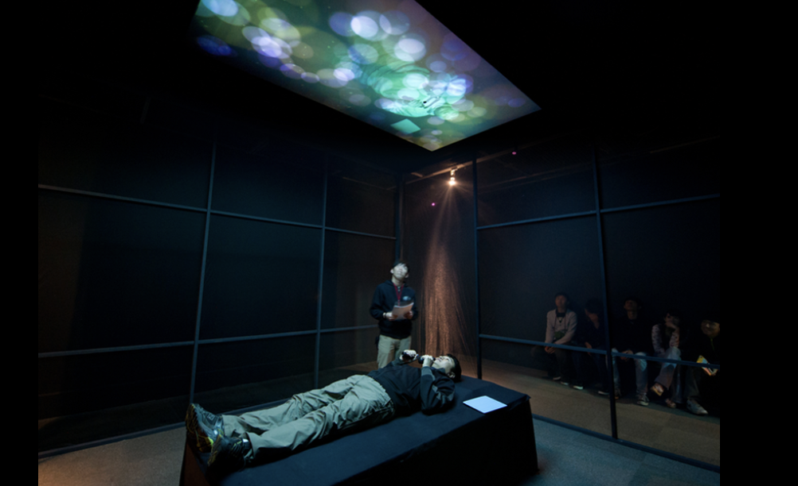
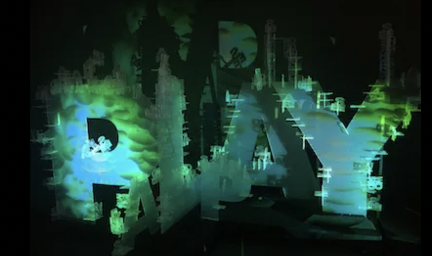
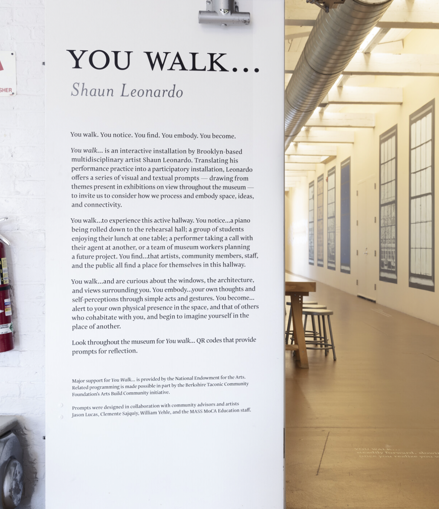
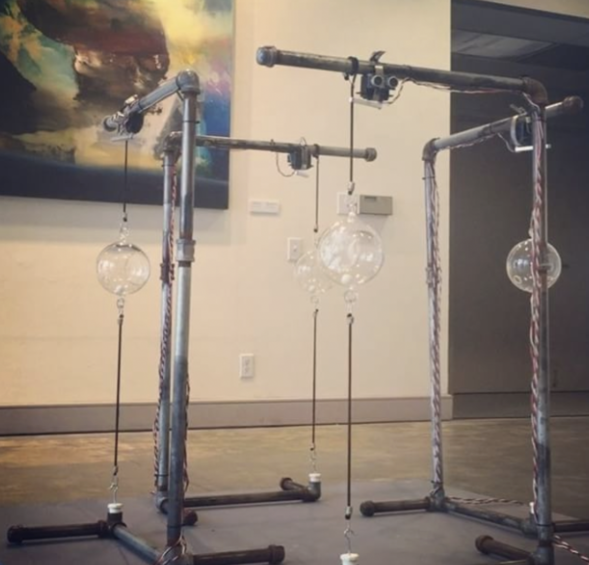

# Week 06

[← Back to Home](../index.md)

## In-Class Activities
 
### 1. Data Exploration

1) Data source and origin

The data for this project is personally collected through observation and self-recorded experiences in everyday learning and social environments. It focuses on communication in classroom discussions and informal conversations, particularly within international student contexts. Instead of using existing datasets, the data is generated through recording moments where communication occurs, pauses, or does not happen.

2) Data content and structure

The dataset records different ways people participate in communication, not only through speaking. It includes:

- speaking frequency (how often a person speaks in a session)
- response delay (time between being asked and responding)
- silence duration (length of non-verbal participation or non-response)
- participation notes (contextual notes about hesitation, translation, or uncertainty)

The data is recorded in a simple log over time, either during or after interactions. Each entry represents a moment of participation, whether or not speech happens. As these entries build up, they form patterns that show both visible participation (speaking) and invisible participation (silence, delay, hesitation).

3) Any limitations, biases, or gaps that you notice, and what these mean for your project direction

One of the main limitations of this dataset is relies on subjective observation and self-reporting. Because it may not accurately capture every moment of participation or silence. Also, when people notice that they are being recorded, they may behave differently than usual, which can alter natural patterns of interaction.

Another limitation is that silence and hesitation are difficult to define clearly. Silence can indicate thinking, discomfort, language processing, or simple disinterest. However, because these different meanings are grouped as “silence,” it creates ambiguity in interpretation.

Furthermore, despite attempts to capture “invisible participation,” the dataset still depends on observable and recordable behaviours. This highlights a broader issue in data systems, where complex human experiences are often reduced to simple, measurable categories.

Nevertheless, these limitations are meaningful. They reveal the gap between lived experience and data representation, and raise important questions about how participation is defined and measured. This directly supports the core aim of this project by making these issues more visible.

## 2. Visual Research and Precedent Study 

**1. Heart Library Project — George Khut**
https://scanlines.net/object/heart-library-project.html
https://www.fact.co.uk/artwork/the-heart-library-project-2007

What draws me to it?
- It immerses visitors by visualising their heart rate data in real time through visual and auditory elements, allowing them to directly experience the connection between the body and mind.

What I carry forward:
- Using biofeedback (heart rate, breathing, bodily signals) as a form of emotional data representation.

Does it change my direction?
- It strengthens my belief that invisible emotional reactions can be captured and physically re-expressed.

**2. The Playground**
https://exertiongameslab.org/projects/the-playground 

What draws me to it?
- It creates a playful environment where participants physically interact and unknowingly generate data through movement.

What I carry forward:
- Designing participation as play, where users do not feel like they are “producing data” but simply engaging.

Does it change my direction?
- It reinforces my idea that participation should feel natural, not forced or overly conscious.

**3.Body of work**
https://shaunleonardo.com/?view-type=body-of-work

What draws me to it?
- This work focuses on how the body holds memory and emotion even when nothing is visually expressed. It reveals that internal states can exist without outward visibility.

What I carry forward:
- The idea that movement and bodily presence can act as invisible data inputs, not just visible performance.

Does it change my direction?
- It reinforces my interest in designing systems where participation is felt internally rather than seen externally.

**5. Wayfinding** 
https://rarar.com/work/wayfinding/ 

What draws me to it?
- It uses movement and environmental feedback to create a responsive spatial system shaped by participants.

What I carry forward:
- The idea of feedback loops between human behaviour and physical space.

Does it change my direction?
- It expands my thinking toward installations that respond dynamically to invisible human actions.

## 3. Project Planning and Skills Roadmap 

At first, I developed two different installation ideas.

The first idea is a Black Box. From the outside, it appears to be an ordinary black box. But when participants wear headphones and place their hands inside, they hear sounds (heartbeats, trembling breathing, and vibrations) and physically feel tactile elements (vibrations or temperature changes) through their hands. This experience is designed to show that even when there are no visible reactions on the surface, invisible emotions, tension, and participation still exist internally. Participants who have had similar experiences feel empathy, while those who have not had such experiences may begin to understand the feeling of invisible participation.

The second idea is a participatory installation using a transparent box. Participants are presented with questions such as, “Have you ever wanted to speak but stopped yourself?” If they relate to the experience, they place a marble into the transparent box. Over time, the marbles gradually accumulate, making invisible silence and hesitation visible as a form of collective data.

I was drawn to both ideas because I felt that each one effectively communicated the core theme of my project. After careful consideration, I decided to combine the two concepts.
The outcome I want to create is an interactive installation where participants first experience invisible participation and hidden emotions physically through the Black Box, and then leave traces of their own experiences or empathy by placing marbles into the transparent box. Rather than simply observing the artwork, participants actively feel, engage, and become part of the data themselves. As time passes, the marbles inside the transparent box continue to grow, revealing individual silence and invisible participation as a collective presence. Through this project, I want to question the idea that participation only exists through speaking or visible actions, and instead make overlooked emotions and experiences visible through physical and sensory interaction.

## Independent Study

### 1. Consultation Reflection

During the proposal consultation, my tutor noted that while my core idea was interesting, the project had become too complex by trying to show too much at once. I was asked to explain more specifically how AI reduces direct human communication, a connection I had made to link my concept to a future scenario, but had not clearly justified. The most useful question was what do you want your audience to feel. I answered understanding and empathy, and this helped me refocus on what really matters. Through this conversation, my project shitf. I realised the AI angle was forced, so I decided to remove it and concentrate on "invisible participation" — why silence occurs, what it feels like, and why existing systems fail to capture it. To make this visible, I will use data physicalisation, translating silence and hesitation into tangible, sensory forms. This connects naturally to surveillance, critiquing how automated systems evaluate only what is visible. Moving forward, I plan to ground this project in personal experience and directly collected data. This discussion gave me a much clearer sense of direction.

### 2. Technical Skill Building

### 3. Initial Concept Sketch

