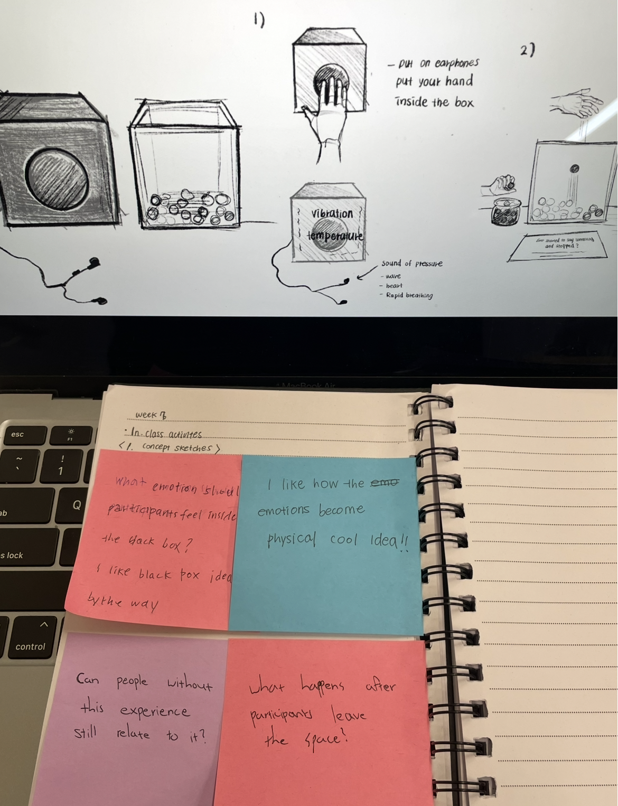
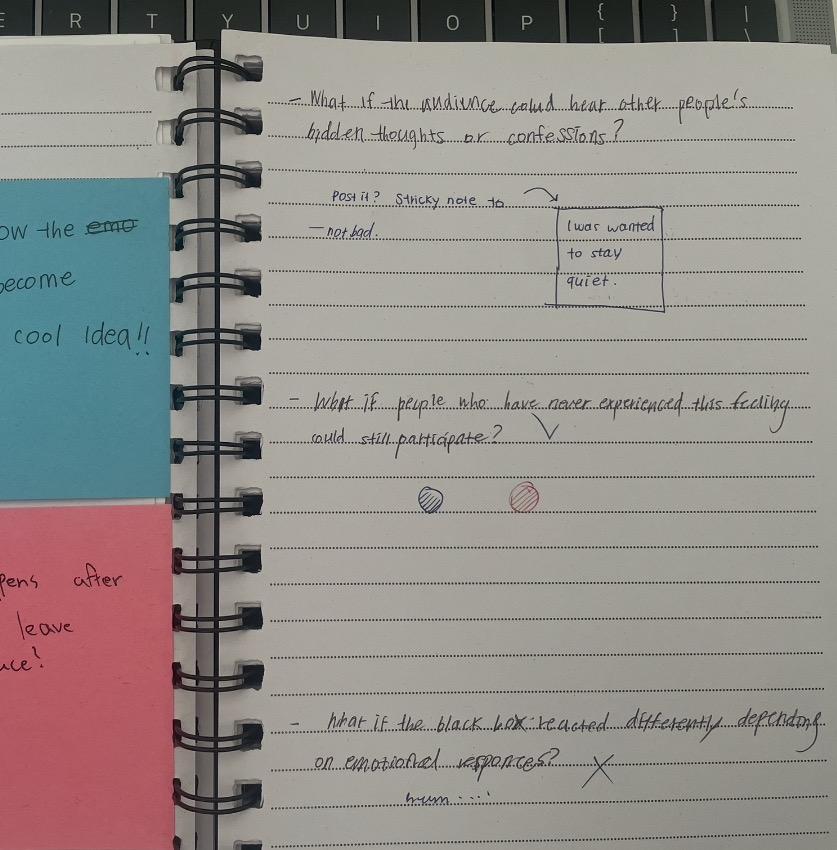

# Week 07

[← Back to Home](../index.md)

--- 

# Data Physicalisation Project – Invisible Participation

--- 

## In-Class Activities

### 1. Concept Sketches

*Figure 1. Photograph of the concept sketch activity and received feedback.*

This week, I further developed my initial concept by visualising the project's emotional journey and participatory structure in detail.

After displaying my sketches, I exchanged feedback with other students. They found the approach of connecting emotional data with a tactile experience particularly interesting. Several students commented that the strongest aspect of the project was its ability to make invisible emotions physically felt.

At the same time, I received several important questions. For example, some students asked, “Will people who have not had these experiences still be able to relate to the project?” and “What emotions do you want participants to feel inside the black box?”

These questions helped me realise the importance of making the project emotionally accessible to a wider audience, rather than limiting it to those who have personally experienced similar situations. They also highlighted the need for a participatory journey that encourages people to connect the experience with their own emotions and memories, rather than simply observing the installation.

Based on the feedback received during the concept sketch activity, I identified areas for further development within the project. In particular, I considered refining the sensory elements inside the black box and improving the participation flow. Additionally, I considered additional reflective questions throughout the experience to increase participants' emotional immersion and enhance empathy.

---

### 2. Making Sprint

During this Making Sprint, I focused on rapidly testing the core sensory experience of the project. Rather than making an outcome, the goal was to experiment with elements that could generate emotional tension and immersion.

I began by researching sound references for the black box experience. I compared heartbeat sounds, slow breathing, and low-frequency ambient audio to explore which types of sound could best evoke feelings of tension and anxiety. I also investigated a range of materials and textures to understand how tactile sensations might influence emotional experiences.

**The materials I explored included:** 
 - Rough sandpaper → tension and physical discomfort
 - Cold metal surfaces (aluminium, steel) → emotional distance and unease
 - Subtle vibrating motors → anxiety and nervousness
 - Uneven surfaces (texture paste, stone, hardened silicone) → unpredictability
 - Slippery materials with low friction (acrylic, plastic film) → instability and uncertainty
 - Thin, crinkling materials (Mylar film, plastic sheets) → sensitivity and tension
 - Dark fabric and confined spaces → sensory restriction and pressure

Research suggests that rough and vibrating surfaces can trigger stronger emotional responses associated with anxiety and discomfort (ScienceDirect, 2022). Based on these findings, I also considered incorporating vibration motors into the black box so that participants could experience tension more directly through their bodies.

Although this was an early-stage exploration, the process helped me better understand the core purpose of the project. I realised that the focus is not simply on visualising data, but on transforming emotional states into physical and embodied experiences that participants can feel and reflect upon.

---

### 3. ‘What if’ Variations

*Figure 2. Photograph of the note of what if variations*

During the Making Sprint feedback session, I shared my project with another student. I explained what I was trying to create, the goals of the installation, and how the current participation system worked. My partner responded positively to the concept, noting that the installation effectively communicated a sense of emotional immersion. Then proposed several “what if” questions that challenged me to expand the concept further:

 - **“What if the audience could hear other people’s hidden thoughts or confessions?”**
 - **“What if people who have never experienced this feeling could still participate?”**
 - **“What if the Black Box reacted differently depending on emotional responses?”**

Among these suggestions, the question, **“What if people who have never experienced this feeling could still participate?”** had the greatest impact on the development of my project.

This feedback encouraged me to reconsider the participation structure. My original plan focused on participants who had experienced silence, hesitation, or emotional suppression, asking them to reflect on those experiences and respond by contributing a bead. However, this discussion made me realise that participation could also include people who had not directly experienced these emotions, but who were willing to recognise, interpret, and empathise with the experiences of others.

Therefore, I developed a revised participation system using different coloured beads. Participants who have personally experienced silence or hesitation place a blue bead to represent empathy through lived experience. Participants who have not experienced these feelings directly place a red bead to represent recognition, understanding, and support for the emotions of others.

This change expanded the project from a personal archive of emotional experiences into a shared system of understanding, where multiple forms of participation coexist. Rather than recording only individual experiences, the installation now generates a more layered and collective emotional dataset that reflects both personal memory and empathetic engagement.

---

## Independent Study

### 1. Project Development & Skill Building

This week, I continued developing my project based on the Making Sprint and “What if” Variations activities, focusing on translating emotional data into a physical and embodied experience.

During Concept Sketch feedback, I refined the participation flow and considered adding reflective questions to enhance emotional immersion and empathy. The experience was structured as a progression from emotional recall to self-reflection, for example: “Have you ever wanted to speak but stayed silent?”, followed by “Think about a moment when your voice remained unspoken,” and finally, “Leave a marble to mark your experience.”

In the Making Sprint, I explored sensory elements for the Black Box, including sound and touch. I compared heartbeat, breathing, and ambient audio, finding heartbeat sound most effective in immediately conveying tension. I also tested tactile ideas such as rough and cold surfaces to express emotional states physically.

I also explored early prototyping with vibration motors to create a sense of tension inside the Black Box. However, I identified a gap in my technical knowledge regarding implementation and plan to investigate this further in the next Progress Report session.

Through the “What if” activity, I developed a revised participation system in which participants use blue marbles for lived experience of silence and red marbles for recognition and empathy without direct experience.

Overall, this week clarified that the project is evolving beyond data visualisation into a participatory installation that enables emotional reflection, physical engagement, and collective empathy.

---

### 2. Progress Report

For next week’s progress report, I organised the current direction of my project and the experimental processes conducted so far.

The project is currently in a stage of developing both the emotional experience and the participatory structure centred around the Black Box. One of the key decisions made so far is the participation system in which participants who have experienced silence or hesitation express empathy by placing a blue bead, while participants who have not had these experiences place a red bead to represent their recognition and understanding of others’ emotions.

In addition, I have been adding reflective questions for flow and conducting research into sound, tactile materials, and spatial configuration.

To gather feedback, I have also prepared the following questions:

 - What materials or technologies could strengthen the tactile experience inside the Black Box?
 - Since the Black Box experience is designed for one person at a time, does this limit participation, or could it instead strengthen intimacy and personal reflection?
 - Does the transition between the Black Box experience and the participation process feel meaningful and conceptually connected?

Through these questions, I aim to explore directions for further developing both the emotional experience and the participatory structure of the project.
 
--- 

# References

https://www.sciencedirect.com/science/article/pii/S2352573822000063?utm_source=chatgpt.com  
