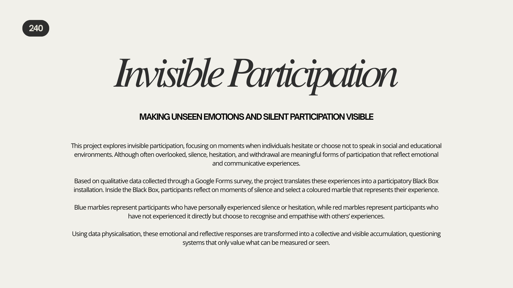
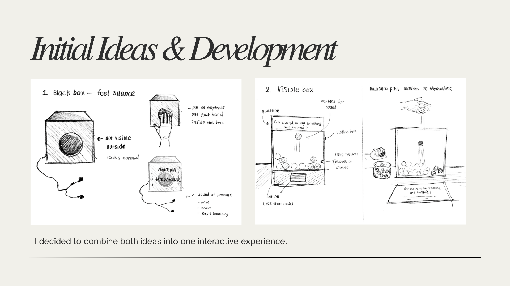
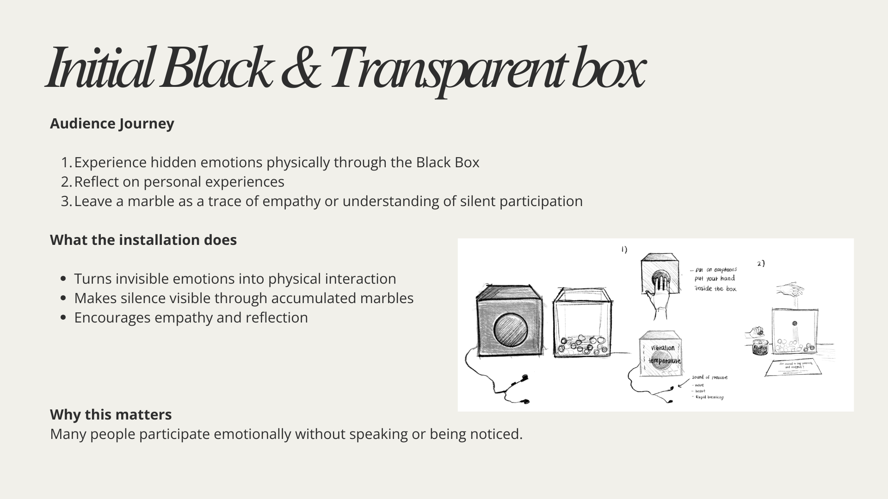
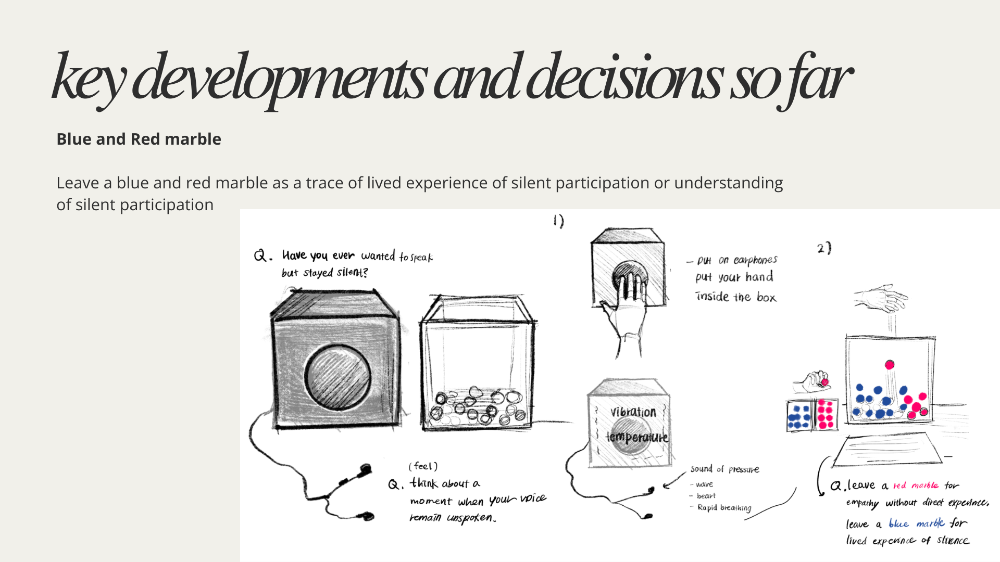
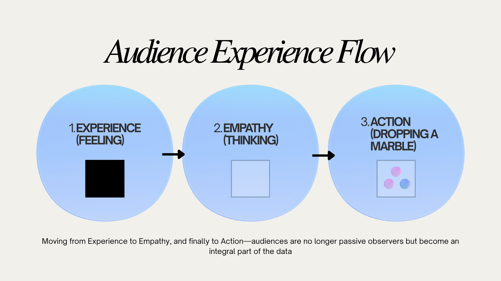
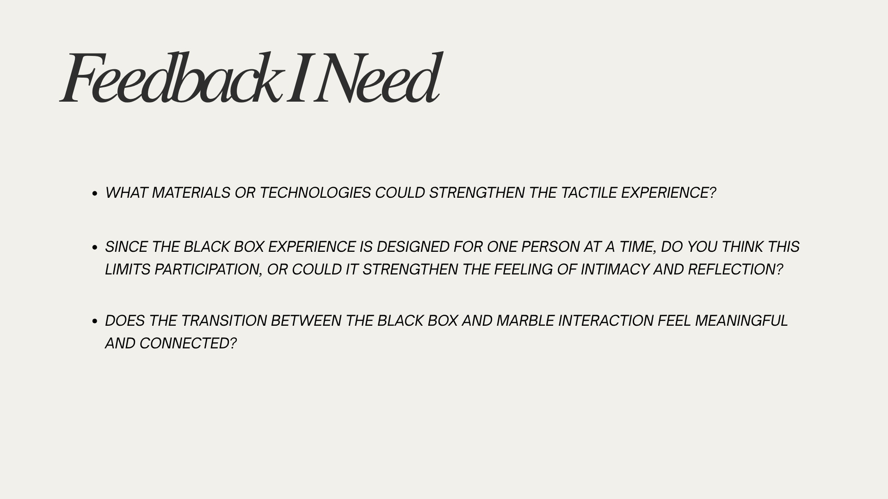
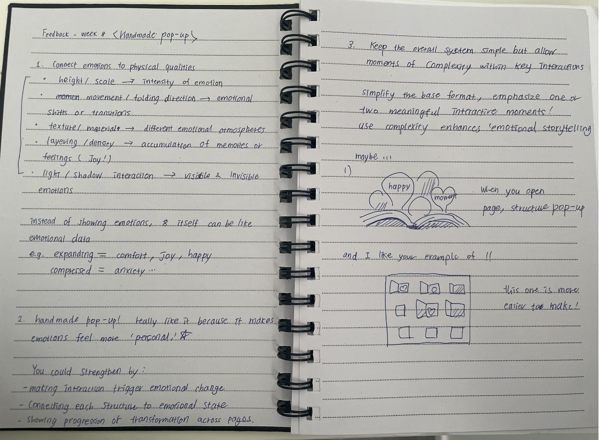
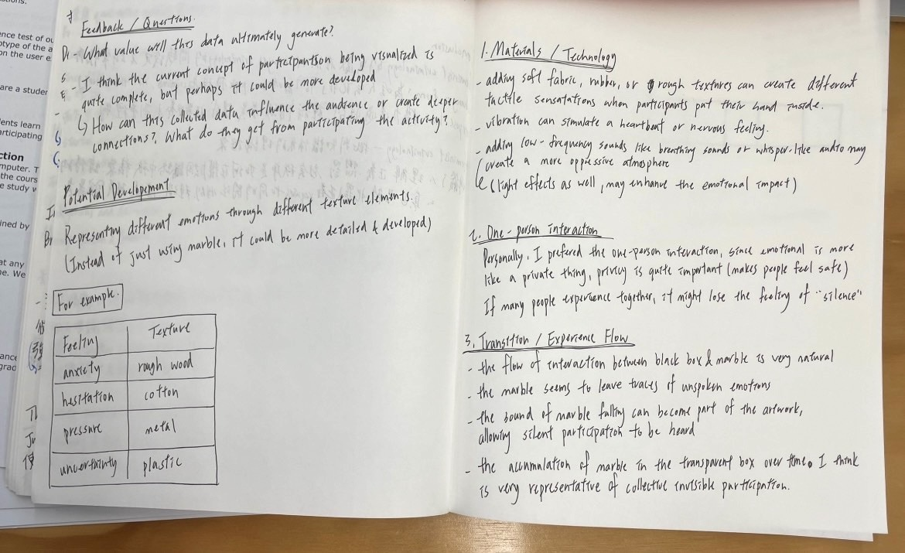

# Week 08

[← Back to Home](../index.md)

--- 

# Data Physicalisation Project – Invisible Participation

--- 

## In-Class Activities

### 1. Progress Reports

*Figure 1–6. Slideshow used for progress report presentation.*

In this week’s progress report, I shared a slideshow with the group outlining the current direction of my project and installation ideas.

After the presentation, the most notable feedback was that the project does not just “show” data, lets people experience emotions directly. People also mentioned that the single-participant experience, something I had been worried about, was actually seen as a strength.

They also gave positive feedback on the connection between the Black Box and Transparent Box structure, and said the way it links emotion and data was interesting.

--- 

### 2. Critical Design Propositions

During the peer critique session, I exchanged feedback with a partner from another group. We presented our projects to each other and engaged in a critical discussion around structure, meaning, and user impact. The notes below summarise both the feedback I gave and the feedback I received.

*Figure 7. Feedback notes provided by me.*

Figure 8. Feedback received from peers*

---

#### Peer Feedback Summary (Received Feedback)

The main concern raised was the ultimate value generated by the data, particularly what impact and deeper connection it creates for the audience. Another key question focused on what participants gain from engaging with the system beyond simple data input.

--- 

#### Key Feedback Insights

 - The current participation structure is coherent and well developed
 - The meaning and impact of the data need further strengthening
 - The experiential outcome for participants should be made clearer

--- 

#### Potential Development Directions

Based on the feedback, one possible direction is to extend the system beyond colour-based categorisation into a tactile and material-based framework.

Instead of using only colour-coded beads, emotional states could be translated into material qualities:

 - Anxiety → rough wood
 - Hesitation → cotton
 - Pressure → metal
 - Uncertainty → plastic

This allows emotion to be communicated through physical sensation, creating a more embodied form of data representation.

However, while this was an interesting idea, it raised questions about whether categorising emotions aligns with the core focus of the project.

--- 

#### Materials and Sensory Exploration

Further exploration could include:

 - Soft fabrics, rubber, and textured surfaces for tactile variation
 - Vibration motors to simulate tension or heartbeat
 - Low-frequency sound, breathing, and whispering audio to create spatial pressure
 - Lighting design to enhance immersion

These elements shift the work from data representation to sensory experience.

--- 

#### One-Person Interaction Feedback

The one-person black box structure was seen as appropriate, as emotional experiences are personal and may benefit from privacy and focused immersion. This also supports the concept of silence as a core theme.

--- 

#### Transition and Experience Flow

The transition between the black box experience and the bead system was considered coherent and effective. The beads were interpreted as traces of unspoken emotions, while their gradual accumulation within a transparent container clearly represents invisible participation becoming visible over time.

--- 

## Independent Study

### 1. Reflective Summary

Based on feedback from the progress report and critical design proposition sessions, I realised that the main challenge in my project was not the clarity of the system itself, but the need to strengthen the ultimate value and impact of the data being produced. While the concept of visualising “invisible participation” through silence, hesitation, and emotional absence was considered coherent and well-developed, I was encouraged to clarify what participants actually gain from engaging with the system beyond contributing data.

Another key insight was the importance of making the emotional outcome of the experience more explicit. Although the Black Box and Transparent Accumulation System effectively communicate a transition from private emotional experience to collective physical archive, I was asked to further strengthen the connection between participation, emotional reflection, and meaning-making.

In response to this feedback, I decided to maintain the core structure of the project, as both the one-person Black Box experience and the bead-based accumulation system were positively received. However, I will further develop the experiential clarity by refining the sensory design inside the Black Box and strengthening the reflective questions that guide participants through emotional recognition.

I also considered expanding the potential development ideas different materials depending on the emotion instead of beads. However, I decided to be careful not to over-categorise emotions, as this could weaken the open and interpretive nature of silence as data.

Overall, this feedback helped me refine my focus from simply “representing emotional data” toward creating a more meaningful participatory experience where invisible participation becomes both physically visible and emotionally understandable.

--- 

### 2. Project Development

As part of the project development process, I continued collecting survey responses and have currently gathered 16 responses. One of the survey questions asked participants, “If you could describe that emotion as a tactile feeling, what would it feel like?”

Several responses shared similar descriptions, including “cold and heavy,” “sharp and uncomfortable,” “soft but trapped,” “rough and tense,” and “empty and still.” These recurring sensory qualities provided insight into how participants physically imagined their emotional experiences.

Initially, I considered using vibration motors to simulate feelings of tension and anxiety inside the Black Box. However, after reviewing the survey responses and reflecting on the purpose of the project, I decided to focus more on tactile materials. The role of the Black Box is not to make participants feel a specific emotion such as anxiety or discomfort. Instead, **it functions as a reflective space that encourages participants to recall a moment when they wanted to speak but remained silent.**

Based on this understanding, I began collecting and testing materials such as sandpaper, rough paper, crumpled paper, and cold or textured surfaces. These materials are not intended to directly represent specific emotions. Rather, they create sensory prompts that support memory, reflection, and personal interpretation. Different participants may associate these sensations with different experiences, which aligns with the project's focus on silence as an open and subjective form of participation.

Through this process, I learned that the Black Box is not to generate specific emotions. Instead, it should encourage participants to recall and reflect on their own experiences of silence and hesitation.

