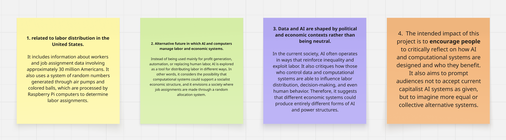
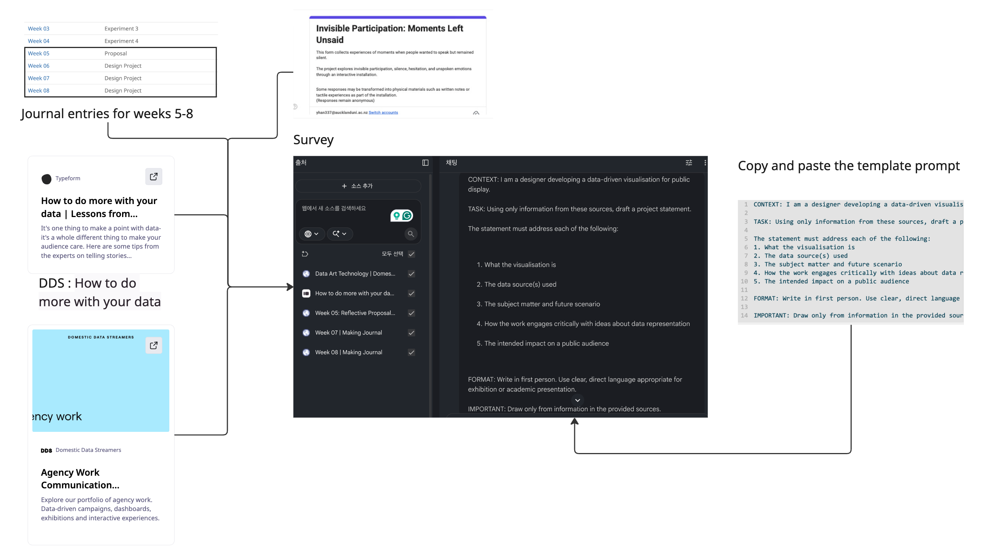
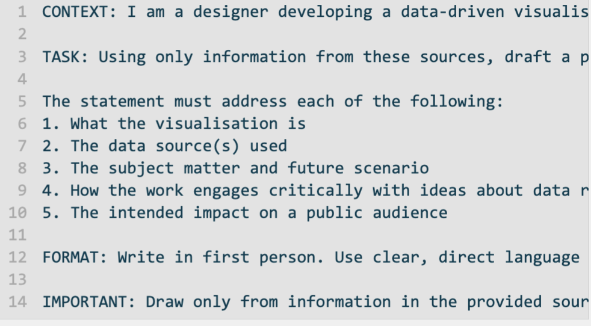
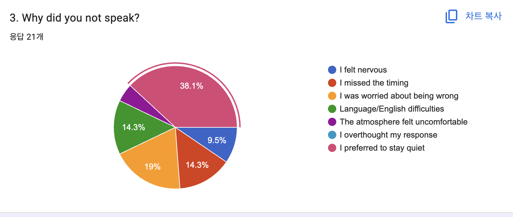
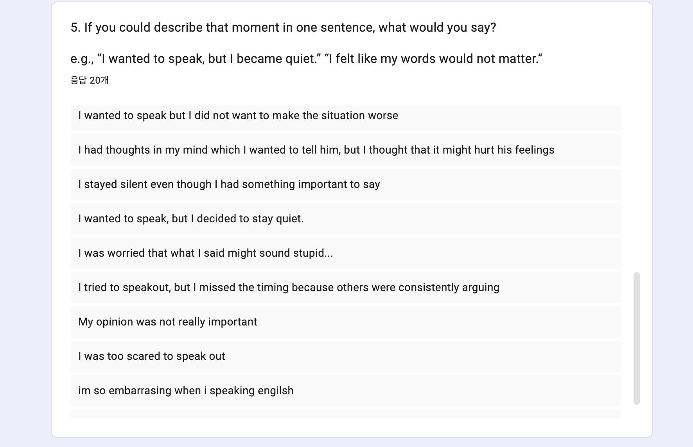
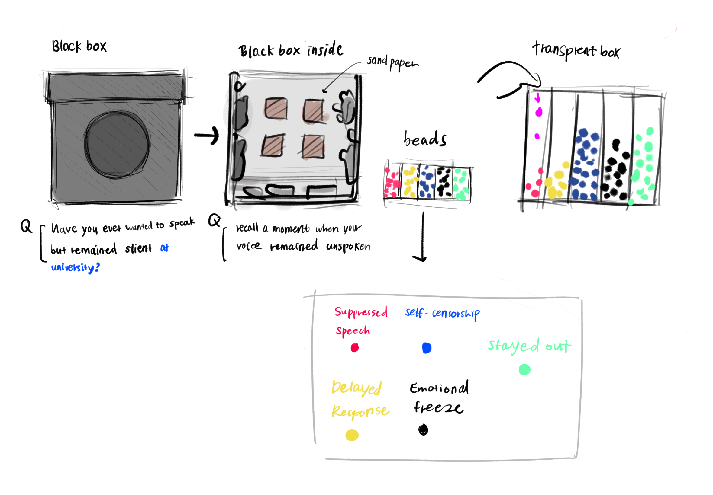

# Week 09

[← Back to Home](../index.md)

--- 

# Data Physicalisation Project – Invisible Participation

--- 

## In-Class Activities

### 1. Project Statement: First Draft

#### 1.1 Case Study

I worked with my partner to read *“Xeno Computer 0.1: A Case Study of Labour”* by Tega Brain and Sam Lavigne, and then we answered the questions using sticky notes.

*Figure 1. Miro board showing collected feedback notes.*

**1. What is the data source used in this study?**
The data source used in this study relates to labour distribution in the United States. It includes information about workers and job assignment data involving approximately 30 million Americans. It also uses a system of random numbers generated through air pumps and coloured balls, which are processed by Raspberry Pi computers to determine labour assignments.

**2. What future scenario does this report address?**
It explores an alternative future in which AI and computers manage labour and economic systems. Instead of being used mainly for profit generation, automation, or replacing human labour, AI is considered as a tool for distributing labour in different ways. In other words, it imagines the possibility that computational systems could support a socialist economic structure, where job assignments are made through a random allocation system.

**3. What does this statement claim about data and power?**
It argues that data and AI are shaped by political and economic contexts rather than being neutral. In current society, AI often operates in ways that reinforce inequality and exploit labour. It also critiques how those who control data and computational systems can influence labour distribution, decision-making, and even human behaviour. Therefore, it suggests that different economic systems could produce entirely different forms of AI and power structures.

**4. What is the intended impact, and is it included in the statement?**
The intended impact of this project is to encourage people to critically reflect on how AI and computational systems are designed and who they benefit. It also aims to prompt audiences not to accept current capitalist AI systems as given, but to imagine more equal or collective alternative systems.

--- 

#### 1.2 Drafting with NotebookLM

*Figure 2. Screenshot of the adding sources into NotebookLM-generated project statement draft*

I uploaded my reflective proposal, Weeks 5–8 journal entries, practitioner references, and survey documentation into NotebookLM and used the project statement prompt provided in class. The following draft was generated:

[My project, **Invisible Participation**, is an **interactive data physicalisation** that explores the hidden weight of silence in our social and educational lives. It focuses on the concept of "invisible participation"—those moments of hesitation, silence, and unspoken communication that shape our experiences but are often overlooked by traditional data systems. The work is grounded in a **future scenario** where academic institutions move away from strictly measuring spoken words and instead begin to record and recognise silence as a meaningful and valid form of engagement.

To create this installation, I used **original qualitative data** gathered from surveys with university students, specifically international and multilingual individuals, who shared their personal reflections and tactile descriptions of staying silent. I transform these subjective, self-reported memories into a two-part physical experience. First, you enter a private **"Sensory Black Box"** designed for solo immersion. Inside, auditory stimuli such as heartbeats and tactile materials like rough sandpaper or cold metal act as sensory prompts, encouraging you to recall and reflect on your own memories of hesitation.

Following this reflection, you contribute to a **"Transparent Accumulation System"**. By placing a blue marble to represent lived experience or a red marble to represent empathy and recognition of others, you help build a collective physical archive. As these objects gather, they manifest the literal weight and volume of unspoken words, making the invisible visible.

This work **critically engages with data representation** by challenging the assumption that participation must be measurable or vocal to be significant. It suggests that silence is not an absence of data, but a meaningful action that reveals social structures and power. My **intended impact** is to shift your perspective so that you see silence and hesitation not as a lack of participation, but as a profound and essential part of our shared communication.

***

**Note on underdeveloped elements:** The specific details of the future scenario underwent a significant shift during development; an earlier concept focused on AI surveillance and participation scores was largely removed to focus on the institutional recognition of silence.]

--- 

#### 1.3 Evaluation

After reviewing the NotebookLM draft, I wrote the following reflections:

**What is working well?**
 - The revised NotebookLM draft clearly communicates the overall structure and intention of the project. The relationship between the Black Box and the Transparent Accumulation System is well defined, and the concept of invisible participation is consistently maintained throughout the statement. The shift in the future scenario also strengthens clarity, as the project now focuses more directly on institutional recognition of silence rather than abstract technological surveillance. This makes the overall direction more focused and easier to understand.

---

**What is missing or underdeveloped?**
 - The interaction flow between the Black Box experience and the accumulation system still needs to be explained more clearly. In particular, the transition from sensory reflection to physical decision-making is not yet fully explicit from the user’s perspective. The reasoning behind how silence is translated into a meaningful form of participation could also be strengthened further. Additionally, the relationship between the blue/red marble system and its social or relational meaning could be developed beyond simple representation to better communicate its conceptual depth.

---

**What feels overly generalised or AI-like?**
 - Some expressions such as “meaningful action,” “shifted perspective,” and “collective archive” remain too general and could benefit from more specific connection to the actual interaction design. Phrases like “challenging traditional systems” are still quite abstract and would be stronger if directly linked to user experience or design decisions within the installation. However, compared to earlier versions, the revised draft is clearer and less overly conceptual.
 
---

**What do you need to research further?**
 - Further research is needed into data physicalisation practices that deal specifically with silence, non-verbal participation, and embodied interaction. It would also be useful to explore how participatory systems translate individual reflection into collective datasets in a way that is legible and intuitive for users. In addition, more theoretical grounding around silence as a form of participation in social and educational contexts would strengthen the conceptual foundation of the project.

---

**One sentence commitment**
 - I aim to reframe Invisible Participation by positioning silence and hesitation as meaningful forms of engagement, developing a sensory and physical data system that transforms unspoken experiences into a collective and visible form of participation.

---

#### 1.4 Peer Share

After finishing the draft and evaluation notes, I shared them with a peer and asked for feedback.

**What was clear and compelling:**

 My peer responded positively to the overall concept and found the relationship between silence,  experience and reminder of silence, and physical accumulation to be clear and easy to understand. She also responded well to the idea of transforming invisible participation into a visible, collective archive through the accumulation of beads, describing it as a strong and engaging concept. 

**What still needs to be developed or resolved:** 

My peer suggested that I further clarify how the transition between the Black Box experience and the Transparent Accumulation System works, particularly how individual reflection becomes collective physical data. She also mentioned that the interaction flow of the installation could be more clearly communicated, especially how participants move from sensory reflection to physical contribution. This would help strengthen the overall coherence of the experience. 

---

### 2. Making Sprint

Before starting the making sprint, I planned my approach. I identified the need to develop and test a prototype using tangible materials in order to clarify the relationship between the Black Box and the Transparent Accumulation System. I also aimed to refine the interaction flow between the two systems and explore sensory experiences through physical materials.

--- 

*Figure 3. Completed prototype for Round Robin Rapid Reactions.*

During the 35-minute making session, I began developing a simple prototype of the Black Box using an actual box structure. Inside the box, I tested a range of sensory materials, including crumpled paper, foil-like blister packaging (tablet packaging), thin plastic film materials, and cold water, to explore different tactile sensations related to tension, discomfort, and emotional memory. I also cut an opening in the box large enough for a hand to enter, allowing participants to physically engage with the internal materials.

To simulate the Transparent Accumulation System, I used an iPad drawing application as a temporary visual interface to explain how collected responses could be recorded and accumulated. I also prepared a heartbeat sound as an auditory element to enhance the sensory environment inside the Black Box.

In addition, I prepared prompt questions such as “Have you ever experienced a moment of silence where you wanted to speak but didn’t?” along with two response options: Have you ever felt this way?, Do you understand what it feels like to stay silent? 

Due to time limitations, the system was not fully completed or tested with participants. However, this sprint helped me understand how material choices and simple interactive prompts can already begin to communicate the core idea of invisible participation, even in an early-stage prototype.

---

### 3. Round Robin Rapid Reactions

During the Round Robin Rapid Reactions session, I presented my project statement and making sprint outcomes to tutors and peers and received a range of feedback.

Overall, one tutor and peer responded positively to the project concept, particularly the idea of translating invisible participation into a physical and sensory system. At first, they had some difficulty fully understanding the relationship between the Black Box experience and the accumulation system.However, after I explained the concept more clearly, they were able to understand the intention and responded positively to the idea. They also agreed that the core concept was strong and engaging once clarified.

However, two other tutors raised important issues regarding clarity and interaction design. One of the main points of confusion was the meaning of the colour-coded bead system. Although I intended the system to distinguish between lived experience (blue beads) and empathetic understanding (red beads), this distinction was not clearly understood during explanation. The prompt questions, such as “Have you ever felt this way?” and “Do you understand what it feels like to stay silent?”, were also not fully clear in guiding participants toward the intended response.

Another key piece of feedback was that the transition between the Black Box experience and the Transparent Accumulation System was still unclear. One tutor suggested that the second stage of the system needs to be more explicitly connected to the sensory experience in the Black Box, as currently the relationship between the two feels disconnected.

Through this feedback, I realised that although I had previously received mostly positive responses from peers, I had not fully identified issues in clarity and user understanding. As a result, I plan to simplify the response options and strengthen the connection between the Black Box experience and the bead accumulation system in future iterations. This session highlighted the importance of simplifying instructions and strengthening the conceptual and experiential link between the two systems.

--- 

## Independent Study

### 1. Project Development

After the Round Robin Rapid Reactions session, I began to reflect more deeply on my project. While preparing the prototype within a limited timeframe, I did not sufficiently develop the instructions and guiding questions for participants, which resulted in a lack of clarity in communicating the project’s intent. In particular, feedback from tutors revealed that participants interpreted the concept in different ways. While this was partly due to my English, I realised that the main issue was that I had explained the project in a somewhat abstract manner.

In the initial project, participants were asked questions such as “Have you ever felt this way?” or “Do you understand what it feels like to stay silent?”, and were then asked to choose between a blue bead and a red bead. However, several tutors noted that this distinction was not intuitive, and that the connection between the sensory experience inside the Black Box and the act of selecting a bead was not clearly communicated.

I also reconsidered the role of the Black Box. Initially, I attempted to evoke tension or anxiety through heartbeat sounds and various tactile materials. However, I came to understand that the purpose of the project is not to generate a specific emotional response, but rather to help participants recall their own experiences of silence. As a result, the Black Box was redefined as a sensory interface that centres on the question, “Have you experienced a moment where you wanted to speak but stayed silent?”, guiding participants to reflect on moments of silence rather than inducing discomfort. Consequently, the overly tense sound elements were removed.

Based on this feedback, I revisited the overall structure of the project. Previously, I had simplified silence into a binary response of ‘experienced’ or ‘not experienced’, but I realised that this did not sufficiently reveal the project’s core idea of “invisible participation.”

*Figure 4-5. Screenshots of survey responses.*

Therefore, I began to move away from treating silence as a single emotional state and instead explored it as a multidimensional form of participatory data. After reviewing responses from the survey questions “Why did you not speak?” and “If you could describe that moment in one sentence, what would you say?”, I began to classify different types of silence based on participants’ answers.

To categorise these varied experiences of silence, I developed five key categories: 

 - Suppressed Speech (wanting to speak but being unable to)
 - Self-Censorship (choosing not to speak)
 - Emotional Freeze (being unable to respond in the moment)
 - Delayed Response (missing the timing to speak)
 - Social Withdrawal (withdrawing from participation altogether)

(To support this approach, I added the question “How would you classify this moment of silence?” to the survey. I also asked the friends who had previously participated in the survey to complete it again, and encouraged them to share it with people in their own networks in order to gather a wider range of responses)

In this new system, participants first place their hand inside the Black Box and explore a range of tactile surfaces with different textures. These materials are designed to act as sensory triggers, encouraging participants to recall the discomfort, tension, hesitation, and physical sensations associated with a moment when they wanted to speak but remained silent. After engaging with the tactile experience, participants reflect on their own experience of silence and select the category that most closely matches that moment. They are then given a corresponding bead, which is placed into the transparent accumulation system. Through this process, each participant becomes a single data point, and each bead functions as encoded data representing a specific experience of silence.

This shift moves the project further away from emotional expression and toward the physicalisation of data. The accumulated result can be read through colour, density, and distribution. If certain colours appear more frequently, this indicates that specific types of silence occur more often. The density of beads reflects the scale of participation, while clusters of colours can visually reveal social patterns and shared experiences.

Through this development process, I came to understand more clearly that the core of the project is not to reproduce a specific emotion, but to translate unmeasured silence and hesitation into data and materialise it into a collective, physical form. In doing so, I began to question the conventional idea that only those who speak are considered participants, and instead developed the project toward recognising invisible participation as a valid form of data.

*Figure 6. New idea sketch*

---

### 1.2 Project Development (material exploration)

During the development stage, I explored and sourced materials for the physical construction of the installation. Material availability directly influenced several design decisions, leading to adjustments in both structure and form.

*Figure 7. Photo of the red box*

For the Black Box, I initially searched for a black square box but was unable to find one in an appropriate size. I therefore selected a red square box and wrapped it in black material. The interior remains red, creating a strong contrast between inside and outside, which reinforces the idea of hidden internal experience versus external appearance.

*Figure 8. Bead materials*

For the representation of silence as accumulation, I originally intended to use marbles but could not find them. I replaced them with beads, which quite small but still effectively communicate accumulation over time. Five different bead colours will be used to represent variation within the dataset.

For the Transparent Accumulation System, I explored a range of material options and ultimately decided to construct the structure using acrylic sheets. The final design consists of an approximately 20 × 20 cm base divided into a grid of 3 × 3 cm compartments (arranged in a 3 × 20 structure), forming a thin modular box system for data accumulation.

*Figure 9. Acrylic sheet*

Considering that the beads are approximately 5 mm in size, this scale was chosen to ensure that gradual accumulation remains visible and legible over time. However, the current volume of data (20 survey responses) suggests that further participation may be needed to enhance the visual impact of accumulation within the system. 

---

### 2. Progress Report

To prepare for next week's 5-minute progress report, I organised the current state of my project into a simple slideshow.

The presentation includes:

- The current concept of *Invisible Participation* and the overall installation system, including the Black Box and Transparent Accumulation System.
- My current draft project statement, which focuses on making invisible participation visible through data physicalisation.
- Key developments since Week 8, including the shift from emotion-based bead responses to a silence classification system, the redesign of the participation flow, and the refinement of the Black Box as a space for reflection rather than emotional stimulation.
- Visual references that informed the project, particularly around sensory interaction, participation, and data physicalisation.
- Specific questions for feedback, including:

  - Are the five categories of silence clear and meaningful?
  - Is the relationship between the Black Box and the marble accumulation system easy to understand?
  - Was removing the heartbeat sound and other tension-inducing audio the right decision, or would some form of sound strengthen the experience?

Preparing this presentation helped me reflect on how the project has evolved from representing emotions to creating a system that records, classifies, and visualises invisible participation. It also highlighted areas that still require further testing and refinement before the final showcase.

---

### AI Usage Statement
Google. (2026). NotebookLM [AI-powered research and writing assistant]. https://notebooklm.google.com/
