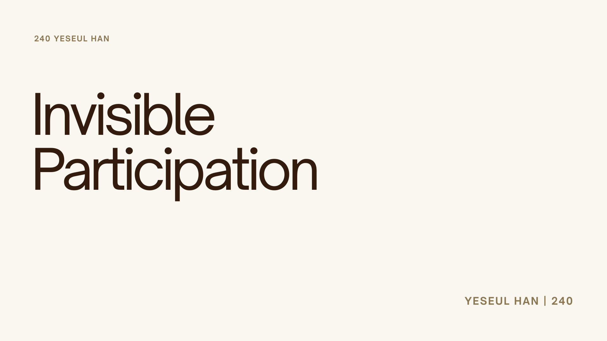
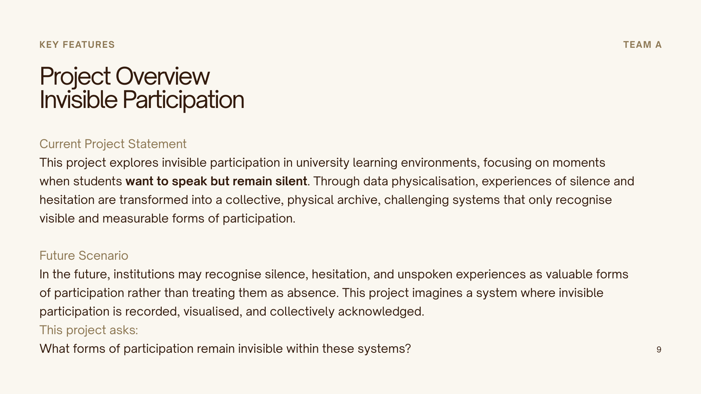
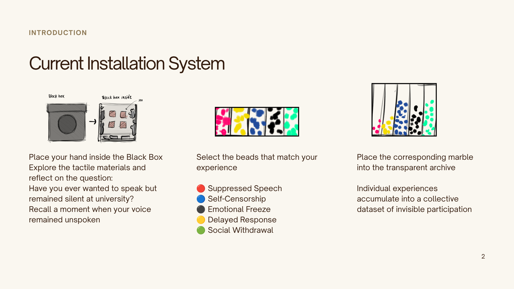
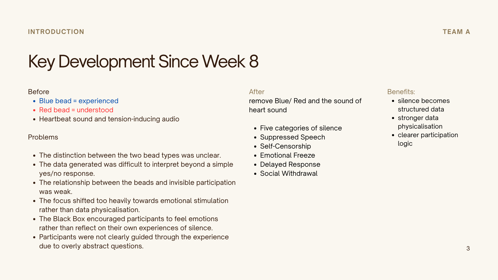
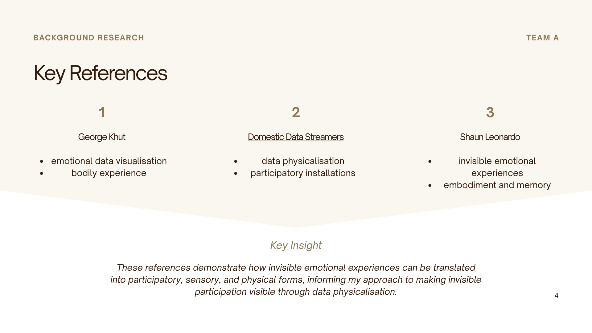
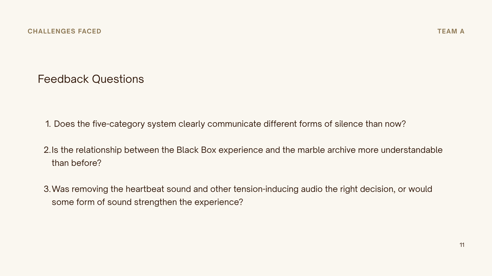
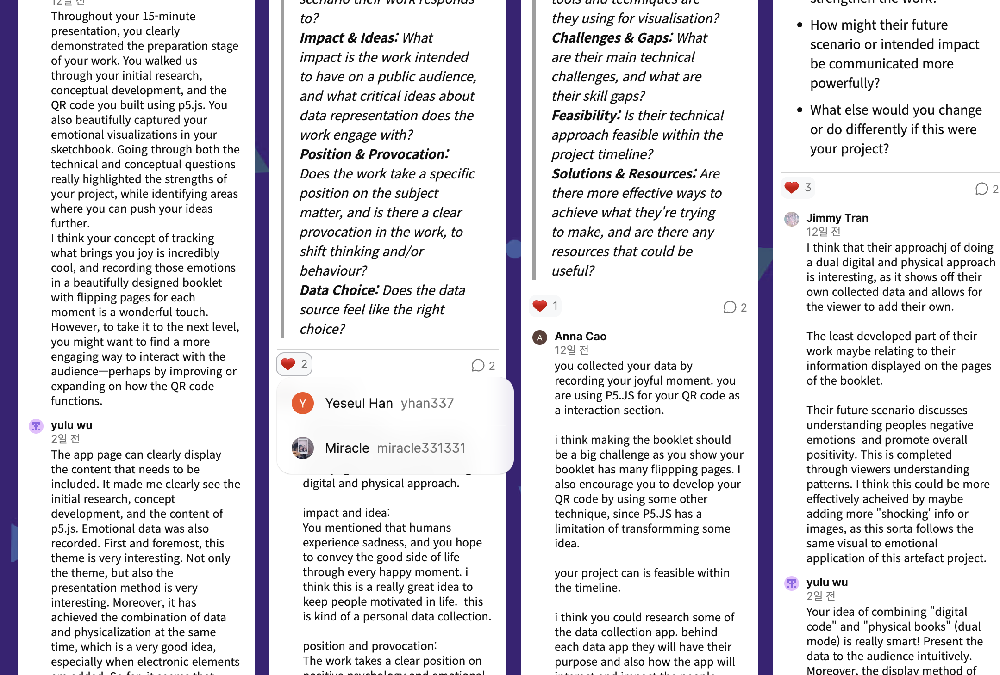

# Week 10

[← Back to Home](../index.md)

## Documentation 

--- 

# Data Physicalisation Project – Invisible Participation

--- 

## In-Class Activities

### 1. Progress Reports

*Figure 1–6. Slideshow used for progress report presentation.*

This week, I was unable to attend class, so I completed the Progress Report activity outside of class with my peer, Hyein. We presented the current state of our projects to each other, including the overall project direction, project statement, major developments since Week 8, and the evolving interaction system of Invisible Participation.

After my presentation, I asked Hyein to respond to a set of feedback questions that I had prepared in advance. These questions focused on the clarity of the interaction flow and the relationship between the Black Box and the Transparent Accumulation System:

 - Does the five-category system clearly communicate different forms of silence?
 - Is the relationship between the Black Box experience and the marble archive more understandable than before?
 - Was removing the heartbeat sound and other tension-inducing audio the right decision, or would some form of sound strengthen the experience?

Initially, Hyein said that both approaches seemed effective and that she was unsure which option would work better. To help her evaluate the experience more accurately, I allowed her to directly experience the sound component. Afterward, she commented that the heartbeat audio created feelings of tension and anxiety, which could distract participants from the intended reflective experience. She suggested that removing the sound and focusing more strongly on the tactile qualities of the interaction would communicate the project's intention more effectively.

[data](../assets/week-10/hy.png)
[data](../assets/week-10/hy2.png)
Figure X. 고쳐.

Following this discussion, Hyein and I exchanged feedback using the four collaboration metrics. Overall, she demonstrated a strong understanding of my project's intention and structure, and her feedback was largely positive. In particular, she noted that the revised project structure communicates the future scenario and overall narrative flow more effectively.

One of the most positively received changes was the shift from the original red-and-blue marble system (representing people who had experienced silence in educational environments and those who understood that experience) to the five-category classification of silence. She commented that this change made the project much easier to understand and allowed the concept of Invisible Participation to be expressed in a more meaningful way.
She also suggested adding greater depth to the dataset and strengthening the connection between individual experiences and the collective archive, which could further reinforce the project's overall message.

A key piece of feedback from Hyein was that participants should be able to understand the interaction process without requiring verbal explanation from the facilitator. To achieve this, she suggested improving the clarity of instructions and strengthening visual cues throughout the installation so that the relationship between the Black Box experience, the classification of silence, and the bead accumulation system becomes more intuitive. She also encouraged me to test the Black Box with people around me to observe how they interacted with the installation and identify any points of confusion. This feedback highlighted the importance of creating a more intuitive and self-explanatory experience that participants can navigate independently.

--- 

### 2. Gallery Walk

2. Gallery Walk

Figure X. Development of the Black Box prototype, including the hand opening, black exterior covering, and added fabric to conceal the interior.

As I was unable to attend class, I could not directly participate in the Gallery Walk activity or view the presentations from other groups. However, I accessed the Padlet boards, reviewed the feedback categories and discussion prompts, and used the heart function to upvote comments that I found particularly helpful.

Reviewing the feedback structure encouraged me to reflect on my own project from both technical and conceptual perspectives. In particular, the prompts encouraged me to think more critically about how Invisible Participation communicates its future scenario, intended impact, and overall interaction flow. This helped me consider whether the relationship between participation, silence, and data is clearly communicated to an audience.

---

### 3. Action Plan 

The most significant feedback I received concerned clarity rather than concept. While the overall idea was considered strong, the interaction flow could still be improved so that participants immediately understand how their experience inside the Black Box becomes part of the collective archive.

As a result, my main action point is to refine the participant instructions and interaction sequence. I plan to develop clearer prompts inside the Black Box and improve the transition between reflection, category selection, and marble placement. I also want to continue testing the five-category silence system with users to ensure that each category is easily understood without additional explanation.

Another important action point is strengthening the communication of the future scenario. Rather than focusing on technological evaluation systems, I want the project to clearly communicate its central idea: that silence and hesitation should not automatically be treated as absence. Through the final installation, I aim to encourage audiences to reconsider what participation means and to recognise invisible experiences as valuable forms of contribution.

--- 

### Independent Study

#### 1. Project Development

Based on both Hyein’s and this testing feedback, I also refined the instruction system to ensure that the interaction can be understood without verbal explanation from the facilitator. The aim was to make the process more self-explanatory and intuitive.

--- 

1. Start by placing your hand inside the Black Box.

---

2. Black Box (Reflection)

**Reach into the Black Box and reflect on a moment in your educational experience when you wanted to speak but remained silent.**

Explore the different textures inside the box. Touch the inner surfaces of the box, including the walls and interior panels. Feel free to move your hands around and notice how each surface feels different.

You may also find crumpled pieces of paper. Feel free to take one out and read it. These are anonymous reflections collected from the survey.

After reading, please return the paper to the box.

---

3. Transparent Accumulation System (Accumulation)

**Which type of silence best represents your experience?**

Choose one marble that corresponds to your experience:

🔴 **Suppressed Speech**
*I had something to say, but held it back.*

🔵 **Self-Censorship**
*I stopped myself before speaking.*

⚫ **Emotional Freeze**
*No words came out.*

🟡 **Delayed Response**
*The moment passed before I could speak.*

🟢 Social Withdrawal
*I stayed silent throughout.*

Place your marble into the transparent archive.

By contributing a marble, your silent moment becomes part of a collective archive of unspoken participation, questioning current educational systems that privilege speech over silence, and proposing silence as a recognised form of participation.

---

Process: Black Box → Reflect → Select one marble → Place in archive

이건 프린트해서 금욜에 해놓을거임 

---

#### 1.1 Project Development (Making Black Box)

*Figure X. Development of the Black Box prototype, including the hand opening, black exterior covering, and added fabric to conceal the interior.

Before I make the black box, the first task was creating a hole large enough for participants to place their hands inside the box. My father helped cut a circular hole in the side of the box. The hole was made large enough to accommodate larger hands as well.

*Figure X. Development of the Black Box prototype black exterior covering

Afterwards, I covered the box with crumpled black wrapping paper. The use of crumpled material was intentional. It helps make the box feel unclear and partly hidden. After cutting, I noticed that the large hole made it possible to see inside the box, which reduced the sense of concealment. 

*Figure X. Development of the Black Box prototype black exterior covering

To solve this, I attached fabric around the opening inside the box so that participants could not see the interior while still being able to comfortably interact with the materials.

---

After finishing the box, I placed the materials selected through testing inside. Since the surface of coarse sandpaper can be irritating, cut it into small pieces and attach it with spacing to prevent injury to participants. This adjustment ensured safe use while maintaining tactile stimulation.

*Figure X.skect

*Figure X. Development of the Black Box prototype black exterior covering

Additionally, the interior design of the black box was intended to create an environment reminiscent of an actual classroom. The materials were attached and finished according to the sketch.

---

Following feedback from Hyein, I conducted additional informal testing of the Black Box interaction to peers. They suggested that the experience of recalling silence could be strengthened through more tangible and embodied triggers, rather than relying only on abstract reflection. Based on this feedback, I asked my peer to test an updated version of the interaction.

*Figure X. Development of the Black Box prototype black exterior covering

During this testing, I introduced a new material component inside the Black Box. I printed anonymous responses collected from my survey (e.g. “I was worried that what I said might sound stupid”) onto paper, crumpled them, and placed them inside the box. Participants were invited to reach in, feel the crumpled paper alongside the tactile surfaces, and optionally take one out to read before returning it. This created a stronger connection between silence as a personal memory and silence as a shared experience. When tested again with peers, they noted that the interaction felt clearer and more emotionally grounded compared to the previous version.

--