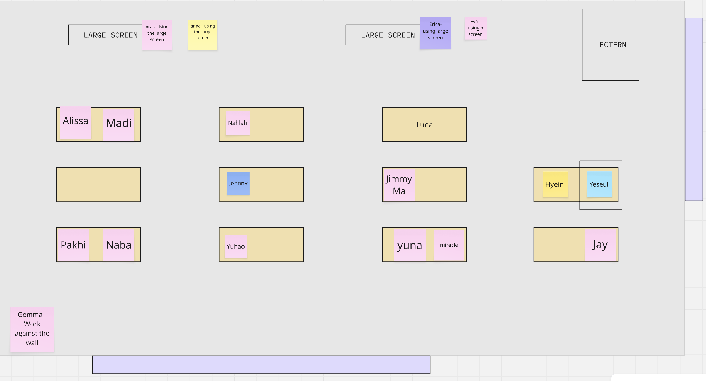
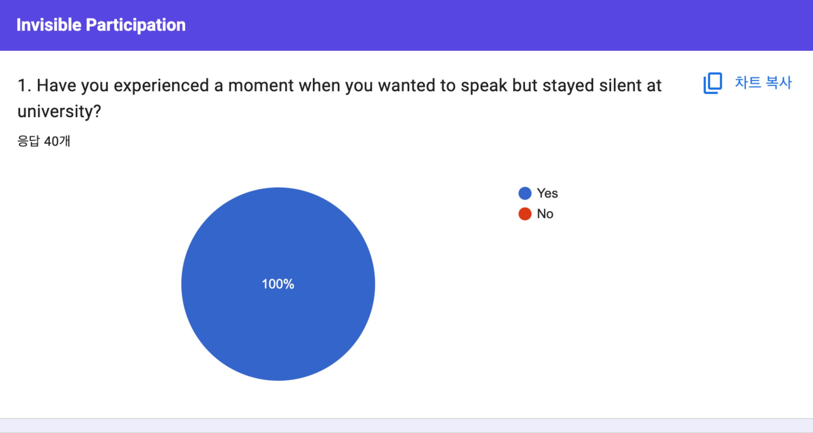
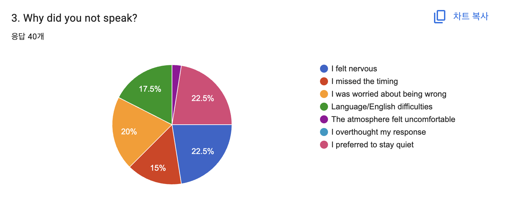
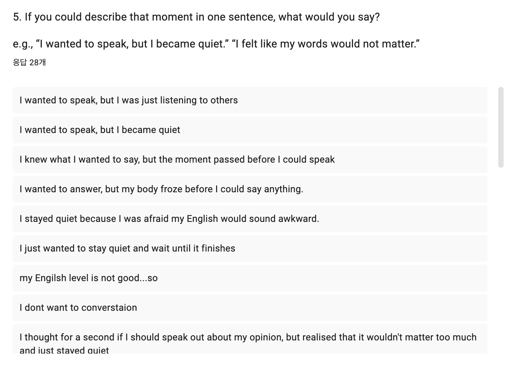
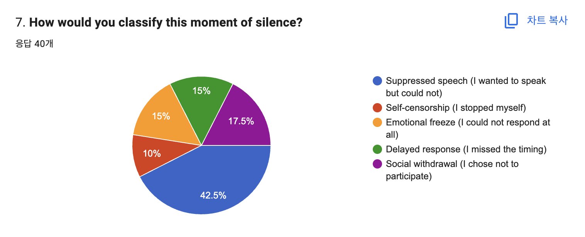

# Week 11

[← Back to Home](../index.md)

## Documentation 

--- 

# Data Physicalisation Project – Invisible Participation

--- 

## In-Class Activities

### 1. Journal Review

In pairs, I reviewed my journal entries for Weeks 6–10 with a Hyien, focusing on clarity, completeness, and the relationship between visual and written documentation. This process helped me reflect on how consistently my project development, feedback, and iterations have been recorded over time. My peer noted that the progression from initial concept to the current interaction system is clearly documented, particularly the shift from a binary bead system to a five-category silence framework.

After reviewing my own journal, I identified three key moments that significantly shaped the direction of my project:

The first was the refinement of my future scenario and thematic focus, where I clarified the project’s position on invisible participation and shifted away from abstract technological framing towards a clearer focus on silence and hesitation as meaningful forms of participation.

The second key moment was the development of the Black Box concept as a sensory space for reflection, which established the foundation of the project by framing silence as an embodied and experiential condition rather than a purely conceptual idea. This was followed by critical feedback on the original red/blue bead system, which revealed issues in clarity and interpretation, leading to a major design decision to shift toward a more structured five-category silence system that improved both usability and conceptual clarity.

The third key moment was the iterative testing of the interaction flow, particularly the realisation that participants needed more explicit and self-explanatory instructions to understand how their embodied experience inside the Black Box translates into the selection of a marble and contributes to the collective archive. This informed the development of a clearer step-by-step interaction structure across the installation.

--- 

### 2. Practice Consultations

The practice consultation was conducted with my peer using the studio consultation questions in a timed format, which helped me practice explaining my project more clearly and fluently.

I was able to explain the overall structure of my project and the relationship between the Black Box and the Transparent Accumulation System. My responses were generally clear and consistent, and I was able to communicate the main interaction flow without major difficulty.

However, I noticed that I tend to focus more on describing the physical system itself rather than clearly articulating its conceptual position within broader discussions of data representation, participation, and visibility. As a result, my explanations sometimes lack conciseness and deeper critical framing.

This also made me aware that I need to more clearly position my project within the idea of data physicalisation, where emotional and subjective experiences are translated into material and collective forms of data. For the final consultation, I will prepare more structured notes and focus on explaining both the system and its conceptual meaning more clearly and confidently.

---

### 3. Showcase Planning

*Figure 1. Showcase planning*

For the showcase, I have decided to install my work at the far right end of the classroom space. I chose this spot because it is quieter and more separate, which fits the reflective nature of the Black Box experience.

This location also helps guide participants through the work more clearly, from the Black Box to the Transparent Accumulation System, without confusion. I will make sure the layout is simple and easy to understand so that people can follow the interaction without explanation.

--- 

## Independent Study

### Project Finalisation

#### Survey Findings and Key Insights

From Weeks 6 to 11, the survey was distributed through social media, friend networks, and personal contacts, resulting in a total of 40 participants. The survey was mainly conducted among University of Auckland students, with a small number of participants from other institutions such as AUT. Most participants were international students.

--- 

*Figure 2. Responses of "Have you experienced a moment when you wanted to speak but stayed silent at university?"*

The most striking result was that 100% of respondents answered “yes” to the question: “Have you experienced a moment when you wanted to speak but stayed silent at university?” This indicates that silence and hesitation are a highly common experience within the university environment.

--- 

*Figure 3. Responses of "Why did you not speak?"*

The reasons for remaining silent were relatively evenly distributed, with anxiety emerging as the most dominant emotion. This suggests that participants were not simply choosing not to speak, but were experiencing silence under psychological tension and pressure.

--- 

*Figure 4. Responses of "If you could describe that moment in one sentence, what would you say?"*

In response to the question “If you were to describe that moment in one sentence?”, a wide range of statements was provided. Among these, five representative sentences that appeared most strongly were selected. 

- I wanted to speak but I was so scared to speak English in front of the class.
- I wanted to join the discussion, but I felt like everyone else was more confident.
- I tried to speak out, but I missed the timing because others were consistently arguing.
- I wanted to speak, but I felt unsure whether my idea was actually relevant, so I stayed silent.
- I felt like I was too scared to speak out.

These five sentences have not yet been printed, but are planned to be printed and placed inside the Black Box, where participants will physically crumple them and interact with them through touch and reading. This functions as a device to translate others’ experiences of silence into a physical and sensory form.

---

*Figure 5. Responses of "How would you classify this moment of silence?"*

Finally, in response to the question “How would you classify this moment of silence?”, the following results were recorded:

Suppressed Speech: 17
Self-censorship: 4
Emotional Freeze: 6
Delayed Response: 6
Social Withdrawal: 7

Some of this data has already been pre-installed into the transparent archive system, and the design is intended to allow real-time accumulation of additional data during the exhibition, where further participation will continuously build the dataset.

--- 

#### Final Clean Version

In the final production stage of the project, the overall interaction structure was reorganised and refined based on the Black Box and transparent bead accumulation system developed in Week 10, with a clearer and more coherent user flow.

---

#### 1. Black Box (Reflection)

Reach into the Black Box and reflect on a moment in your educational experience when you wanted to speak but remained silent.

Explore the different textures inside the box, including the inner walls and surfaces. Notice how each surface feels different through touch.

You may also find crumpled pieces of paper. These are anonymous reflections collected from the survey. Feel free to take one, read it, and return it.

You may choose not to participate if you do not relate to this experience.

---

#### 2. Transparent Accumulation System (Accumulation)

Which type of silence best represents your experience?

Choose one marble:

- 🔴 Suppressed Speech: I had something to say, but held it back.
- 🔵 Self-Censorship: I stopped myself before speaking.
- ⚫ Emotional Freeze: No words came out.
- 🟡 Delayed Response: The moment passed before I could speak.
- 🟢 Social Withdrawal: I stayed silent throughout.

Place your marble into the transparent archive.

Each marble becomes part of a collective archive of unspoken participation.
The survey remains open for continued data collection.

---

Due to the lack of access to printing at the time of testing, these instructions were temporarily written and presented in text form. However, in the final installation, all instruction materials will be professionally printed and physically installed within the space.

---

### Final Installation and Interaction Refinement

I also attempted to construct the remaining acrylic parts using a hot glue gun; however, some areas melted, and the finish was not clean. As an acrylic-specific adhesive was not available locally, I decided to proceed using the components made in Week 10 instead, despite this limitation.

Inside the Black Box, five representative responses derived from the survey were printed and placed inside. Participants are encouraged to crumple these responses, strengthening both recall and sensory engagement through tactile interaction. In addition, the transparent accumulation box was pre-filled with 40 data entries collected from the initial survey, categorised into five colour groups: red/pink tones, sky blue tones, green tones, yellow tones, and dark black tones.

Red/pink tones represent Suppressed Speech (17)
Sky blue tones represent Self-Censorship (4)
Dark black tones represent Emotional Freeze. (6)
Yellow tones represent Delayed Response.(6)
Green tones represent Social Withdrawal.(7)

*Figure 6. First attempt at placing the installation*

Through multiple testing, the instruction texts were distributed throughout the installation space to ensure that participants could intuitively understand the interaction flow and information structure. The question “Have you ever wanted to speak but stayed silent?” was placed on top of the Black Box to make the entry point more immediate and clear. In addition, numbers (1, 2, 3) were added to the top left corner of each instruction sheet to strengthen the clarity of the overall sequence.

Through these adjustments, I was able to address the recurring feedback around clarity. As a result, the project now establishes a spatial experience that can be understood without relying on verbal explanation. It allows meaning to be revealed through the structure, sequence, and physical interactions within the installation.

---

#### Final Artefact

*Figure 7. Final Outcome*

*Figure 2. Final interaction flow, from left to right: participants place their hand into the Black Box, select a marble, and complete the experience.*

--- 

#### Final Project Statement

This project explores the concept of invisible participation within educational environments. It focuses on how silence and hesitation are excluded from dominant systems of participation. Participation is measured through visible and audible actions such as speaking, responding, or contributing verbally. However, it may ignore the unique experiences that help to shape the learning and engagement.

The work is established in a future scenario where educational institutions begin to recognise silence and hesitation as meaningful forms of participation. Within this framework, participation includes what is withheld, delayed, or internally processed, shifting the definition of engagement from performance to experience

The project uses qualitative data collected through a Google Forms survey completed by students, including international and multilingual learners. Participants were asked to reflect on their experiences of remaining silent although they wanted to speak, and to describe the emotional and situational conditions at those moments.

The installation consists of a Black Box where participants physically engage with tactile materials designed to prompt embodied reflection on their own experiences of silence. They may encounter anonymised responses from the survey, which act as fragments of other people’s unspoken experiences

Moreover, the participants work through the Transparent accumulation system. They select a marble corresponding to one of five defined categories of silence and place it into a transparent archive. Each marble represents a translated data point, transforming qualitative experience into a material form. Through accumulation, individual moments of silence form a collective dataset, making invisible participation visible.

Rather than treating silence as absence, this work reframes it as meaningful data. It questions how educational systems define participation and suggests that unspoken experiences carry value, agency, and presence. Ultimately, the project proposes a shift from participation as performance to lived experience, where what is not said becomes visible, shared, and collectively acknowledged within educational space.

---

The project statement has been finalised as outlined above.

--- 

To prepare for the Studio Consultation in class next week, I will develop clear notes and supporting slides to help structure my responses to the following key areas:

The tools and techniques used to collect, interpret, and visualise data
The conceptual development of my work in relation to theories and practices concerned with data representation
The challenges I encountered and how I addressed them
What I learned through the making process
The intended impact of my final data-driven visualisation

These materials will help me communicate my project more clearly and coherently during the consultation.
